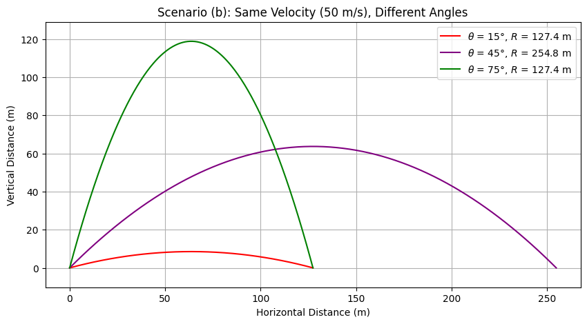

# Problem 1
## **Theoretical Foundation: Governing Equations of Projectile Motion**

### **1. Introduction**
Projectile motion describes the motion of an object under the influence of gravity, assuming no air resistance. The motion occurs in two dimensions: horizontal ($x$-axis) and vertical ($y$-axis). We derive the governing equations starting from Newton’s laws of motion.

### **2. Equations of Motion**
Newton’s second law states:

$$F=ma$$

For projectile motion, the only force acting on the object (neglecting air resistance) is gravity:

$$F_y=-mg,\quad F_x=0$$

Thus, the acceleration components are:

$$a_x=0,\quad a_y=-g$$

where $g$ is the acceleration due to gravity.

Using kinematic equations:


#### **2.1 Vertical Motion**
Using the kinematic equations for constant acceleration,

$$v_y=v_0\sin(\theta)-gt$$

$$y=v_0\sin(\theta)t-\frac{1}{2}gt^2$$


### 🔹 Governing Differential Equations

#### Horizontal Motion

- No horizontal acceleration (ignoring air resistance).
- Velocity in $x$-direction remains constant:

$$\frac{d^2x}{dt^2}=0$$

- Integrating once:

$$\frac{dx}{dt}=v_0\cos(\theta)$$

- Integrating again:

$$x(t)=v_0\cos(\theta)\cdot t$$


### **3. Time of Flight**
The time of flight is found by solving for when the projectile returns to $y=0$:

$$0=v_0\sin(\theta)t-\frac{1}{2}gt^2$$

Factoring out $t$:

$$t(v_0\sin(\theta)-\frac{1}{2}gt)=0$$

Ignoring the trivial solution $t=0$, we solve for $t$:

$$t=\frac{2v_0\sin(\theta)}{g}$$

### **4. Range of the Projectile**
The horizontal range is given by:

$$R=v_x\times t_{flight}$$

Substituting $v_x=v_0\cos(\theta)$ and $t_{flight}$:

$$R=v_0\cos(\theta)\times\frac{2v_0\sin(\theta)}{g}$$

Using the identity $2\sin(\theta)\cos(\theta)=\sin(2\theta)$,

$$R=\frac{v_0^2\sin(2\theta)}{g}$$

### **5. Maximum Height**
At maximum height, $v_y=0$:

$$0=v_0\sin(\theta)-gt_{max}$$

Solving for $t_{max}$:

$$t_{max}=\frac{v_0\sin(\theta)}{g}$$

Using the vertical displacement equation:

$$h_{max}=v_0\sin(\theta)t_{max}-\frac{1}{2}gt_{max}^2$$

Substituting $t_{max}$:

$$h_{max}=\frac{v_0^2\sin^2(\theta)}{2g}$$

### **6. Influence of Initial Conditions**
- **Initial Velocity $v_0$**: Higher velocity increases both range and height.
- **Launch Angle $\theta$**: The range is maximized at $\theta=45^\circ$.
- **Gravity $g$**: Higher gravity decreases range and height.

### **7. Conclusion**
These equations provide a fundamental description of projectile motion. In further analysis, we will explore numerical simulations and practical applications, including air resistance and varying terrains.

---

## **Analysis of the Range in Projectile Motion**

### **1. Introduction**

The horizontal range of a projectile is a crucial parameter that depends on the angle of projection, initial velocity, and gravitational acceleration. Understanding these dependencies allows for optimizing projectile motion in various real-world applications.

### **2. Governing Equation for Range**

The horizontal range $R$ of a projectile launched from the ground at an initial velocity $v_0$ and angle $\theta$ (assuming no air resistance) is given by:

$$R=\frac{v_0^2\sin(2\theta)}{g}$$

where:

- $v_0$ is the initial velocity,
- $g$ is the acceleration due to gravity,
- $\theta$ is the launch angle.

### **3. Dependence on the Angle of Projection**

The function $R(\theta)$ is determined by the term $\sin(2\theta)$. Since the sine function has a maximum value of 1 at $90^\circ$, the range is maximized when:

$$2\theta=90^\circ \Rightarrow \theta=45^\circ$$

Thus, the optimal launch angle for maximum range in an idealized scenario is $\theta=45^\circ$.

### **4. Influence of Initial Velocity**

Since the range equation includes $v_0^2$, increasing the initial velocity directly increases the range quadratically:

$$R \propto v_0^2$$

For example, if the initial velocity is doubled ($2v_0$), the range becomes:

$$R' = \frac{(2v_0)^2\sin(2\theta)}{g} = 4R$$

indicating a fourfold increase in range.

### **5. Effect of Gravitational Acceleration**

Gravity inversely affects the range:

$$R \propto \frac{1}{g}$$

For planets with different gravitational accelerations, the range adjusts accordingly. For example, on the Moon ($g_{moon} \approx 1.625m/s^2$), the same projectile would travel approximately six times farther than on Earth ($g_{earth} \approx 9.81m/s^2$).

### **6. Graphical Representation**

A plot of $R$ versus $\theta$ for various values of $v_0$ and $g$ reveals that:

- The function is symmetric around $\theta=45^\circ$.
- Larger $v_0$ results in a higher curve.
- Higher $g$ compresses the range.

### **7. Conclusion**

The horizontal range is highly dependent on the launch angle, initial velocity, and gravitational acceleration. The optimal angle for maximum range is $45^\circ$ in an idealized case. However, real-world factors such as air resistance, launch height, and varying gravitational fields can alter this result.

Further exploration through computational simulations can refine our understanding of projectile motion in different environments.

---

## **Practical Applications of Projectile Motion**

### **1. Introduction**

Projectile motion plays a fundamental role in numerous real-world scenarios, from sports to engineering and astrophysics. While the idealized equations provide valuable insights, real applications often involve additional complexities such as air resistance, varying gravitational fields, and uneven terrain.

### **2. Projectiles in Sports**

Many sports rely on projectile motion for performance optimization:

- **Basketball:** The optimal shooting angle for a free throw is approximately $45^\circ$ to $50^\circ$, depending on player height and shot distance.
- **Soccer:** Players must account for drag and spin effects (Magnus effect) when executing curved shots.
- **Golf:** Club selection and launch angle impact the carry distance, which is influenced by wind and air resistance.

### **3. Engineering Applications**

Engineers use projectile motion principles in various fields:

- **Ballistics:** Military and defense industries design projectile trajectories considering air resistance and varying gravitational fields.
- **Structural Engineering:** Understanding projectile motion is crucial for designing protective barriers and impact-resistant structures.
- **Water Jet Cutting:** Pressurized water follows parabolic motion, requiring precise calculations for cutting efficiency.

### **4. Space and Astrophysics**

In space exploration, projectile motion extends beyond Earth's gravity:

- **Rocket Launches:** Engineers optimize launch angles and thrust to maximize efficiency while escaping Earth's gravitational pull.
- **Asteroid Deflection:** Scientists calculate the trajectory of projectiles used to alter asteroid paths.
- **Interplanetary Travel:** Orbital mechanics rely on projectile motion principles, with gravity assists optimizing fuel efficiency.

### **5. Projectiles on Uneven Terrain**

When projectiles land on uneven ground, the standard range equation requires modifications:

If the projectile lands at height $h$ instead of the launch height, the modified range equation is:

$$R=\frac{v_0\cos\theta}{g}\left(v_0\sin\theta+\sqrt{(v_0\sin\theta)^2+2gh}\right)$$

where:

- $h$ is the final landing height,
- $g$ is gravitational acceleration,
- $v_0$ is initial velocity,
- $\theta$ is the launch angle.

This formula accounts for different impact points depending on terrain elevation.

### **6. The Role of Air Resistance**

In real-world applications, air resistance significantly alters projectile trajectories. The equation of motion considering drag force is:

$$m\frac{d^2x}{dt^2} = -kv\frac{dx}{dt}$$  

$$m\frac{d^2y}{dt^2} = -mg - kv\frac{dy}{dt}$$

where:

- $m$ is the mass of the projectile,
- $k$ is the drag coefficient,
- $v$ is velocity.

These equations require numerical solutions due to their complexity.

### **7. Conclusion**

Projectile motion is a versatile concept with applications across multiple disciplines. By incorporating factors such as air resistance, uneven terrain, and varying gravitational fields, engineers and scientists refine models for real-world accuracy. Computational simulations further enhance predictive capabilities, making projectile motion a cornerstone of physics and engineering.

---

# Python/Plot





```python
import numpy as np
import matplotlib.pyplot as plt
from scipy.integrate import solve_ivp

def projectile_motion_no_drag(v0, theta, g=9.81):
    """Computes the range of projectile motion without air resistance."""
    theta_rad = np.radians(theta)
    range_ = (v0**2 * np.sin(2 * theta_rad)) / g
    return range_

def projectile_motion_with_drag(v0, theta, mass, Cd, A, rho=1.225, g=9.81):
    """Solves the projectile motion equations numerically with air resistance."""
    theta_rad = np.radians(theta)
    vx0 = v0 * np.cos(theta_rad)
    vy0 = v0 * np.sin(theta_rad)
    
    def equations(t, y):
        vx, vy, x, y_pos = y
        v = np.sqrt(vx**2 + vy**2)
        drag_force = 0.5 * rho * Cd * A * v**2
        ax = -drag_force * vx / (mass * v)
        ay = -g - (drag_force * vy / (mass * v))
        return [ax, ay, vx, vy]
    
    sol = solve_ivp(equations, [0, 10], [vx0, vy0, 0, 0], max_step=0.01, events=lambda t, y: y[3])
    return sol.y[2][-1]  # Return final x-position (range)

def plot_range_vs_angle(v0_values, drag=False):
    """Plots range vs. angle for different initial speeds."""
    angles = np.linspace(0, 90, 50)
    plt.figure(figsize=(8, 5))
    
    for v0 in v0_values:
        ranges = []
        for theta in angles:
            if drag:
                range_ = projectile_motion_with_drag(v0, theta, mass=0.145, Cd=0.47, A=0.0014)
            else:
                range_ = projectile_motion_no_drag(v0, theta)
            ranges.append(range_)
        plt.plot(angles, ranges, label=f'v0 = {v0} m/s')
    
    plt.xlabel('Angle of Projection (degrees)')
    plt.ylabel('Range (m)')
    plt.title('Range vs. Angle of Projection')
    plt.legend()
    plt.grid()
    plt.show()

# Example usage:
plot_range_vs_angle([10, 20, 30], drag=False)
```

link: [colab](https://colab.research.google.com/drive/1K0bk1_H0wlBIUVxtvneTUBV-p0d_W_Ti?usp=sharing)