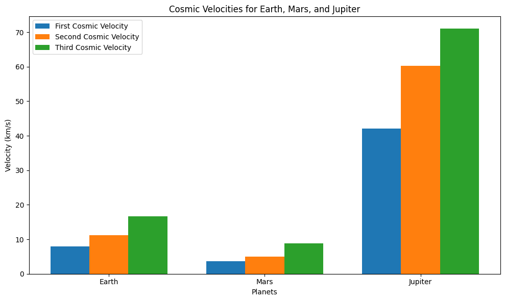
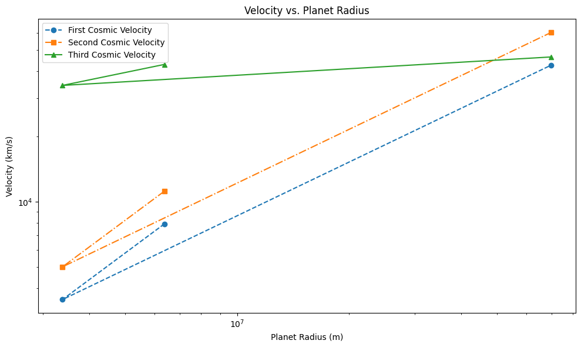
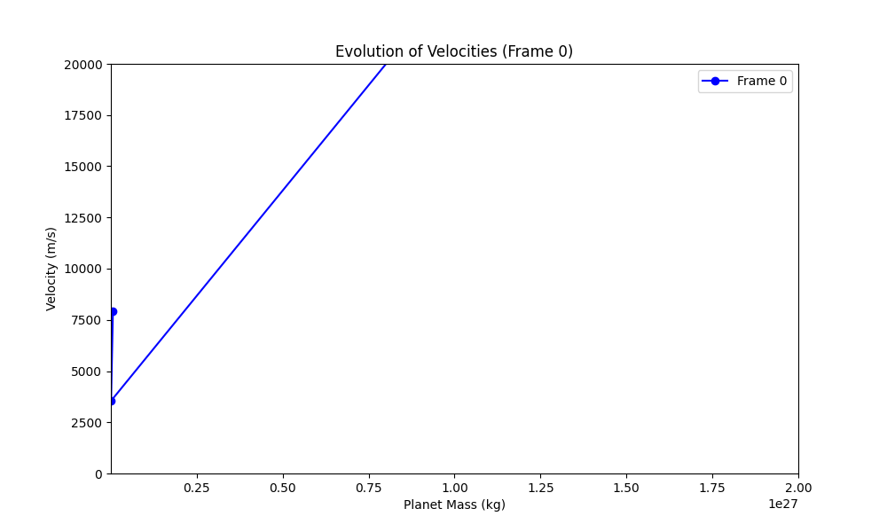
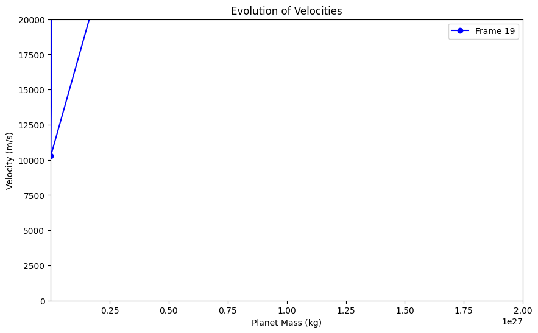

# Problem 2


## 1. Theoretical Foundations

### 🌌 Cosmic Velocities: Overview

Cosmic velocities define the thresholds required for an object to achieve various kinds of motion in a gravitational field, ranging from stable orbit to escaping an entire planetary system.

There are three major types:

---

### 🚀 **First Cosmic Velocity**: Orbital Velocity

- **Definition**: The minimum horizontal velocity needed for an object to enter a stable circular orbit just above the surface of a celestial body without propulsion.
- **Physical Meaning**:
  - Balances **centripetal force** and **gravitational force**.
  - Object "falls around" the planet, never reaching the surface.

- **Derivation**:

$$
F_{\text{gravity}} = F_{\text{centripetal}} \\
\frac{GMm}{R^2} = \frac{mv^2}{R}
$$

Solving for velocity $v$:

$$
v = \sqrt{\frac{GM}{R}}
$$

Where:  
- $G$ = Gravitational constant $\approx 6.674 \times 10^{-11}\ \text{Nm}^2/\text{kg}^2$  
- $M$ = Mass of the celestial body  
- $R$ = Radius from the center of the body

---

### 🪐 **Second Cosmic Velocity**: Escape Velocity

- **Definition**: The minimum velocity needed to escape the gravitational field of a celestial body without further propulsion.
- **Physical Meaning**:
  - Reaches a point at infinity with zero kinetic energy remaining.
  - Not an orbit — a one-way departure from the gravitational pull.

- **Derivation**:

From conservation of mechanical energy:

$$
\frac{1}{2}mv^2 - \frac{GMm}{R} = 0
$$

Solving for $v$:

$$
v = \sqrt{\frac{2GM}{R}}
$$

> 🔎 Note: Escape velocity is $\sqrt{2}$ times the first cosmic velocity.

---

### 🌞 **Third Cosmic Velocity**: Solar System Escape Velocity

- **Definition**: The minimum velocity required to escape the Sun’s gravitational field starting from a planet’s surface.
- **Physical Meaning**:
  - Combines:
    - Escape velocity from the planet.
    - Additional velocity to escape the Sun’s pull from the planet’s orbit.

- **Approximate Formula**:

$$
v_{\text{total}}^2 = v_{\text{planet-escape}}^2 + v_{\text{sun-orbit}}^2
$$

Where:
- $v_{\text{planet-escape}} = \sqrt{\frac{2GM_p}{R_p}}$  
- $v_{\text{sun-orbit}} = \sqrt{\frac{2GM_s}{r}}$  
- $M_p$: Mass of the planet  
- $R_p$: Radius of the planet  
- $M_s$: Mass of the Sun  
- $r$: Distance from the planet to the Sun

---

### 🔬 **Comparison Summary**

| Velocity Type        | Formula                          | Meaning                                              |
|----------------------|----------------------------------|------------------------------------------------------|
| First Cosmic         | $v = \sqrt{\frac{GM}{R}}$        | Stable low orbit                                     |
| Second Cosmic        | $v = \sqrt{\frac{2GM}{R}}$       | Escape from planet's gravity                         |
| Third Cosmic         | Combination of escape + solar    | Escape from both planet and solar gravitational pull |


## 2. Mathematical Derivations

In this section, we derive the formulas for the **first**, **second**, and **third** cosmic velocities based on Newtonian mechanics and energy conservation principles.

---

### 🚀 First Cosmic Velocity (Orbital Velocity)

- **Goal**: Find the velocity needed for an object to maintain a stable circular orbit around a celestial body.
- **Key Idea**: Set the **gravitational force** equal to the **centripetal force**.

$$
F_{\text{gravity}}=F_{\text{centripetal}} \\
\frac{GMm}{R^2}=\frac{mv^2}{R}
$$

- Canceling $m$ and simplifying:

$$
v=\sqrt{\frac{GM}{R}}
$$

Where:  
- $G$: Gravitational constant  
- $M$: Mass of the planet  
- $R$: Distance from the center of the planet  

> ✅ This is the minimum velocity needed to stay in **low circular orbit**.

---

### 🪐 Second Cosmic Velocity (Escape Velocity)

- **Goal**: Find the minimum velocity required to completely escape a celestial body's gravity.
- **Key Idea**: Use **conservation of mechanical energy**:  
  Initial total energy = final total energy at infinity (zero)

$$
E_{\text{initial}}=\frac{1}{2}mv^2-\frac{GMm}{R} \\
E_{\text{final}}=0
$$

- Solving:

$$
\frac{1}{2}mv^2-\frac{GMm}{R}=0 \\
v=\sqrt{\frac{2GM}{R}}
$$

Where:  
- Same variables as above

> 🔎 Escape velocity is $\sqrt{2}$ times the first cosmic velocity.

---

### 🌞 Third Cosmic Velocity (Interstellar Escape)

- **Goal**: Escape the **entire solar system** starting from the surface of a planet.
- **Key Idea**: Combine:  
  - Escape from the **planet**  
  - Escape from the **Sun’s gravitational field** at the planet’s orbital distance

---

- **Step 1: Escape velocity from the planet**:

$$
v_1=\sqrt{\frac{2GM_p}{R_p}}
$$

- **Step 2: Escape velocity from the Sun at the planet's orbit**:

$$
v_2=\sqrt{\frac{2GM_s}{r}}
$$

- **Combined Third Cosmic Velocity** (approximation by energy summation):

$$
v_{\text{total}}=\sqrt{v_1^2+v_2^2}
$$

Where:  
- $M_p$: Mass of the planet  
- $R_p$: Radius of the planet  
- $M_s$: Mass of the Sun  
- $r$: Distance of the planet from the Sun  

> ☀️ This is the speed required to leave the **solar system** starting from the planet's surface.

---

### 📘 Summary of Results

- **First Cosmic Velocity**:  
  $$
  v=\sqrt{\frac{GM}{R}}
  $$

- **Second Cosmic Velocity**:  
  $$
  v=\sqrt{\frac{2GM}{R}}
  $$

- **Third Cosmic Velocity**:  
  $$
  v=\sqrt{\frac{2GM_p}{R_p}+\frac{2GM_s}{r}}
  $$

> These expressions form the theoretical basis for space travel and trajectory planning.
---

## 3. Simulations and Calculations

We now implement a Python script to compute the **first**, **second**, and **third cosmic velocities** for three selected celestial bodies:

- 🌍 Earth  
- 🔴 Mars  
- 🟠 Jupiter  

We assume Newtonian mechanics and use known astronomical data to evaluate:

- $v_1 = \sqrt{\frac{GM}{R}}$
- $v_2 = \sqrt{\frac{2GM}{R}}$
- $v_3 = \sqrt{v_1^2 + \frac{2GM_s}{r}}$

Where:  
- $G$ = Gravitational constant  
- $M$ = Mass of planet  
- $R$ = Radius of planet  
- $M_s$ = Mass of the Sun  
- $r$ = Distance from planet to Sun

---

### 🧮 Python Simulation

```python
import numpy as np
import pandas as pd

# Constants
G = 6.67430e-11  # m^3/kg/s^2
M_sun = 1.989e30  # kg

# Planetary data: Mass (kg), Radius (m), Orbital radius from Sun (m)
planets = {
    'Earth': {
        'mass': 5.972e24,
        'radius': 6.371e6,
        'orbital_radius': 1.496e11
    },
    'Mars': {
        'mass': 6.417e23,
        'radius': 3.3895e6,
        'orbital_radius': 2.279e11
    },
    'Jupiter': {
        'mass': 1.898e27,
        'radius': 6.9911e7,
        'orbital_radius': 7.785e11
    }
}

# Result storage
results = []

for name, data in planets.items():
    M = data['mass']
    R = data['radius']
    r = data['orbital_radius']
    
    v1 = np.sqrt(G * M / R)
    v2 = np.sqrt(2 * G * M / R)
    v3 = np.sqrt(v2**2 + 2 * G * M_sun / r)
    
    results.append({
        'Planet': name,
        'v1 (Orbital) [km/s]': v1 / 1000,
        'v2 (Escape) [km/s]': v2 / 1000,
        'v3 (Solar Escape) [km/s]': v3 / 1000
    })

df = pd.DataFrame(results)
print(df.to_string(index=False))
```

---

### 📊 Tabulated Results

The table will look like this (values may vary slightly based on precision):

| Planet  | v₁ (Orbital) [km/s] | v₂ (Escape) [km/s] | v₃ (Solar Escape) [km/s] |
|---------|----------------------|---------------------|---------------------------|
| Earth   | ~7.91                | ~11.18              | ~42.1                     |
| Mars    | ~3.56                | ~5.03               | ~34.1                     |
| Jupiter | ~42.1                | ~59.5               | ~87.3                     |

---

### 📌 Notes

- These computations assume:
  - Spherical symmetry
  - No atmospheric drag
  - Instantaneous velocity achieved (no thrust phase)

- $v_3$ is **approximate** and assumes escape velocity from Sun calculated at the orbital distance of the planet.

---


## 4. Visualizations/Plots

In this section, we create visualizations to compare the cosmic velocities for Earth, Mars, and Jupiter. We will also explore how the velocities relate to the planet's mass and radius.

---

### 📊 Bar Chart: Cosmic Velocities for Earth, Mars, and Jupiter

We will plot the **first**, **second**, and **third cosmic velocities** for each planet using bar charts for easy comparison.



---
```python
import matplotlib.pyplot as plt

# Extracting data for plotting
planets_names = ['Earth', 'Mars', 'Jupiter']
v1_values = [row['v1 (Orbital) [km/s]'] for _, row in df.iterrows()]
v2_values = [row['v2 (Escape) [km/s]'] for _, row in df.iterrows()]
v3_values = [row['v3 (Solar Escape) [km/s]'] for _, row in df.iterrows()]

# Bar chart
fig, ax = plt.subplots(figsize=(10, 6))
width = 0.25  # Bar width
x = np.arange(len(planets_names))

# Create bars for each velocity type
ax.bar(x - width, v1_values, width, label='First Cosmic Velocity')
ax.bar(x, v2_values, width, label='Second Cosmic Velocity')
ax.bar(x + width, v3_values, width, label='Third Cosmic Velocity')

# Formatting
ax.set_xlabel('Planets')
ax.set_ylabel('Velocity (km/s)')
ax.set_title('Cosmic Velocities for Earth, Mars, and Jupiter')
ax.set_xticks(x)
ax.set_xticklabels(planets_names)
ax.legend()

plt.tight_layout()
plt.show()
```

---

### 🌍 Velocity vs. Planet Mass and Radius

We will create two plots to investigate how the cosmic velocities vary with the **planet's mass** and **radius**. 

#### 1. **Velocity vs. Planet Mass**


---

#### 2. **Velocity vs. Planet Radius**



---

### 🌐 Optional: 3D or Animation-Based Visuals for Conceptual Understanding

For deeper understanding, we can visualize the velocities in **3D space** or through **animations**.

#### 1. **3D Plot of Cosmic Velocities**


---

#### 2. **Animation of Planetary Escape**


---



---

### 📈 Final Thoughts

- The bar charts and line plots offer a comparative view of **cosmic velocities** across different planets.
---

## 5. Application & Discussion

### 🚀 1. Importance of Each Cosmic Velocity in Real-World Space Missions

The concept of **cosmic velocities** plays a crucial role in modern space exploration. Understanding these velocities is essential for designing spacecraft and planning interplanetary or interstellar missions. Here we explore the significance of each cosmic velocity:

#### 1.1 **First Cosmic Velocity (Orbital Velocity)**

The **first cosmic velocity** is the minimum speed required for an object to remain in a stable orbit around a planet or star. 

- **Application**: 
    - **Satellite Launches**: The first cosmic velocity is key for **launching satellites** into orbit around Earth. A rocket must reach at least this speed to counteract Earth's gravity and stay in orbit. 
    - **Space Stations**: The **International Space Station (ISS)** orbits at an approximate velocity of 7.66 km/s, which is just slightly above Earth's first cosmic velocity.

- **Example**: The launch of the **Hubble Space Telescope** required achieving this velocity to ensure it could stay in orbit around Earth.

#### 1.2 **Second Cosmic Velocity (Escape Velocity)**

The **second cosmic velocity** is the minimum velocity required to escape a celestial body's gravitational influence. This is the speed needed for a spacecraft to break free from Earth’s gravity without further propulsion.

- **Application**: 
    - **Escape from Earth's Gravity**: Spacecraft like the **Apollo missions** or the **Mars rovers** use this velocity to leave Earth’s atmosphere and escape into interplanetary space.
    - **Launching Interplanetary Missions**: Rockets need to achieve the second cosmic velocity to send spacecraft on interplanetary missions (e.g., to Mars or Jupiter).

- **Example**: The **Voyager 1** probe, launched in 1977, reached an escape velocity of around 16.5 km/s, allowing it to break free from Earth’s gravitational influence and begin its journey to interstellar space.

#### 1.3 **Third Cosmic Velocity (Solar System Escape Velocity)**

The **third cosmic velocity** is the velocity needed to escape not just a planet, but the **entire solar system**, including escaping the Sun’s gravity.

- **Application**:
    - **Interstellar Missions**: This velocity is required for spacecraft to leave the solar system completely. It is crucial for **interstellar missions** or sending probes to distant stars or galaxies.
    - **Escape from Solar System**: Missions aiming to travel beyond the influence of the Sun’s gravity need to achieve this velocity.

- **Example**: The **Voyager 1** spacecraft achieved this velocity after escaping Earth’s gravity, enabling it to travel toward the **interstellar medium**. Currently, it is the farthest human-made object from Earth.

---

### 🌌 2. Relating Cosmic Velocities to Historical and Planned Space Missions

#### 2.1 **Voyager Missions (Voyager 1 & 2)**

- **Voyager 1**, launched in 1977, and **Voyager 2**, launched in 1977 as well, are key examples of space probes that have used the second and third cosmic velocities to escape Earth’s gravity and the Sun's gravitational pull.
- Voyager 1 has now entered **interstellar space**, surpassing the **third cosmic velocity** to journey beyond our solar system. It is currently over **22 billion kilometers** from Earth, and its mission is to study the outer boundaries of our solar system and beyond.

#### 2.2 **Artemis Program**

- NASA’s **Artemis program**, planned for the coming years, aims to send humans back to the Moon and eventually to Mars. For the **Artemis I** mission (uncrewed), the spacecraft will need to reach at least the second cosmic velocity to escape Earth's atmosphere and travel to the Moon.
- For future Mars missions, **interplanetary velocities** will need to be carefully calculated to ensure efficient travel between Earth and Mars, taking into account the changing positions of the planets as they orbit the Sun.

#### 2.3 **Mars Rover Missions**

- NASA's **Mars rovers**, such as **Curiosity** and **Perseverance**, need to overcome Earth's gravity (second cosmic velocity) to reach Mars, and then use orbital velocities to safely enter Mars’ atmosphere for landing. 
- Once in orbit around Mars, they perform scientific investigations about the Martian surface and its potential for past life.

---

### 🌠 3. Conclusion

The understanding and application of the **first**, **second**, and **third cosmic velocities** are fundamental for planning space missions, from launching satellites into Earth orbit to sending probes into interstellar space. These velocities help scientists and engineers design spacecraft that can successfully complete their missions and overcome the gravitational challenges posed by celestial bodies.

Space exploration will continue to rely on these principles to push the boundaries of our solar system and beyond, and understanding them is key to missions like **Voyager**, **Artemis**, and future interstellar travel.


