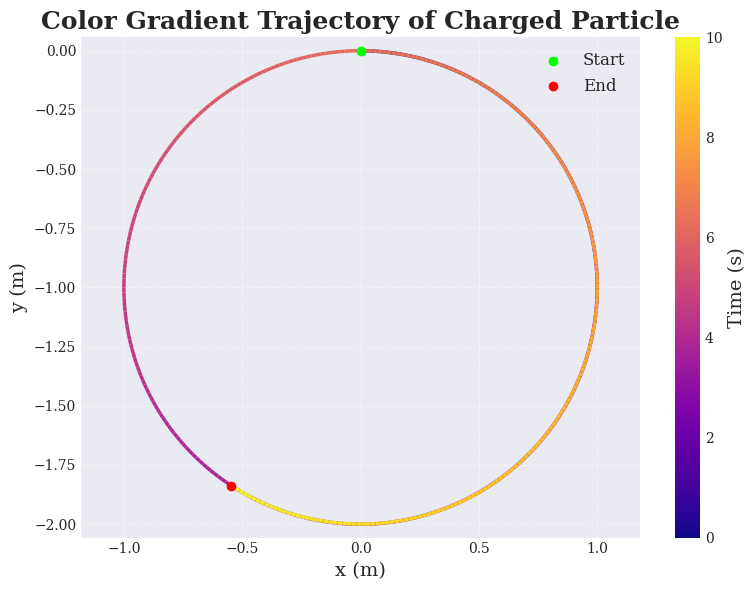
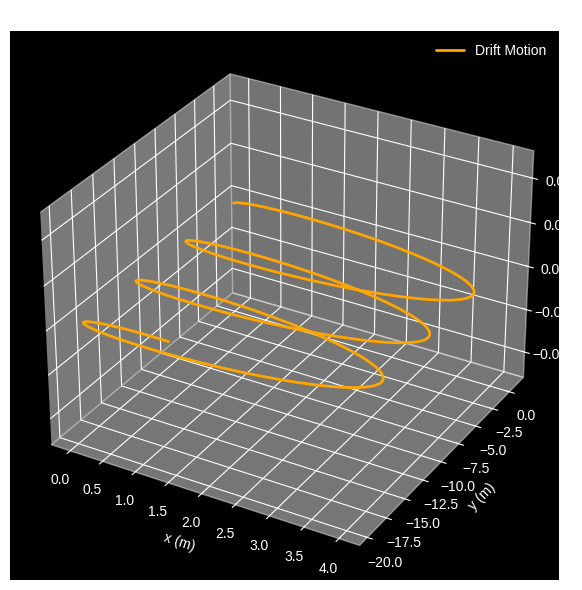
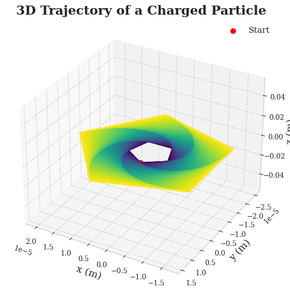

## 1. Exploration of Applications

### 🔹 Real-World Systems Where the Lorentz Force Is Crucial

- **Particle Accelerators**  
  Charged particles are accelerated and steered using electric and magnetic fields.
  
- **Mass Spectrometers**  
  The mass-to-charge ratio of ions is measured based on their deflection under magnetic fields.
  
- **Plasma Confinement Devices (e.g., Tokamaks)**  
  Magnetic fields confine high-temperature plasma to prevent contact with material walls.
  
- **Astrophysical Phenomena**  
  Cosmic rays, solar winds, and planetary magnetospheres are governed by Lorentz force interactions.

- **Cathode Ray Tubes (CRTs)**  
  Electrons are steered onto screens by electric and magnetic fields.

---

### 🔹 Role of $\\mathbf{E}$ and $\\mathbf{B}$ Fields

The **Lorentz force** acting on a particle of charge $q$ moving with velocity $\\mathbf{v}$ is given by:

$$\\mathbf{F}=q\\mathbf{E}+q\\mathbf{v}\\times\\mathbf{B}$$

- **Electric Field $\\mathbf{E}$:**

  - Exerts a force in the direction of $\\mathbf{E}$.

  - Causes linear acceleration of the particle.

- **Magnetic Field $\\mathbf{B}$:**

  - Exerts a force perpendicular to both $\\mathbf{v}$ and $\\mathbf{B}$.

  - Causes circular or helical motion without changing particle speed.

---

## 2. Simulating Particle Motion

We simulate the motion of a charged particle under different electric and magnetic field configurations.

---

### 🔹 Common Setup

```python
import numpy as np
import matplotlib.pyplot as plt
from mpl_toolkits.mplot3d import Axes3D

# Physical constants and initial conditions
q = 1.6e-19  # Charge (C)
m = 9.11e-31 # Mass (kg)
dt = 1e-11   # Time step (s)
steps = 10000 # Number of steps

# Initial conditions
r0 = np.array([0.0, 0.0, 0.0])   # Initial position (m)
v0 = np.array([1e6, 0.0, 0.0])   # Initial velocity (m/s)

# Fields
E = np.array([0.0, 0.0, 0.0])    # Electric field (V/m)
B = np.array([0.0, 0.0, 1.0])    # Magnetic field (T)
```

---

## 2. Scenarios

### 2.1 Uniform Magnetic Field $\\mathbf{B}\\neq0$, $\\mathbf{E}=0$

Under a uniform magnetic field, the particle exhibits **circular** or **helical** motion.

```python
# Fields
E = np.array([0.0, 0.0, 0.0])
B = np.array([0.0, 0.0, 1.0])

trajectory = simulate_lorentz(E, B)

# Visualization
fig = plt.figure(figsize=(8, 6))
ax = fig.add_subplot(111)
ax.plot(trajectory[:,0], trajectory[:,1])
ax.set_xlabel('x (m)')
ax.set_ylabel('y (m)')
ax.set_title('Particle Trajectory in Uniform Magnetic Field')
plt.grid()
plt.show()
```

---

### 2.2 Combined Uniform Electric and Magnetic Fields,
$\\mathbf{E}\\neq0$, $\\mathbf{B}\\neq0$

Both electric and magnetic fields are present, resulting in more **complex motion**.

```python
# Fields
E = np.array([1e3, 0.0, 0.0])
B = np.array([0.0, 0.0, 1.0])

trajectory = simulate_lorentz(E, B)

# Visualization
fig = plt.figure(figsize=(8, 6))
ax = fig.add_subplot(111)
ax.plot(trajectory[:,0], trajectory[:,1])
ax.set_xlabel('x (m)')
ax.set_ylabel('y (m)')
ax.set_title('Particle Trajectory in Combined E and B Fields')
plt.grid()
plt.show()
```

---

### 2.3 Crossed Electric and Magnetic Fields $\\mathbf{E}\\perp\\mathbf{B}$

When $\\mathbf{E}$ is **perpendicular** to $\\mathbf{B}$, the particle experiences **drift motion** with drift velocity:

$$\\mathbf{v}_d = \\frac{\\mathbf{E} \\times \\mathbf{B}}{B^2}$$

```python
# Fields
E = np.array([0.0, 1e3, 0.0])
B = np.array([0.0, 0.0, 1.0])

trajectory = simulate_lorentz(E, B)

# Visualization
fig = plt.figure(figsize=(8, 6))
ax = fig.add_subplot(111)
ax.plot(trajectory[:,0], trajectory[:,1])
ax.set_xlabel('x (m)')
ax.set_ylabel('y (m)')
ax.set_title('Particle Trajectory in Crossed E and B Fields')
plt.grid()
plt.show()
```
---

---

# 📚 Electromagnetism: Lorentz Force Simulation

## 3. Parameter Exploration

We now proceed to systematically **explore how different parameters** affect the trajectory of a charged particle under the influence of electric and magnetic fields.

### 🔧 Parameters to Vary

- **Electric field strength**: $E$ (units: V/m)
- **Magnetic field strength**: $B$ (units: T)
- **Initial velocity of the particle**: $\mathbf{v}$ (units: m/s)
- **Charge of the particle**: $q$ (units: C)
- **Mass of the particle**: $m$ (units: kg)

### ⚡ Lorentz Force Equation

The motion is governed by the **Lorentz Force**:

$$
\mathbf{F}=q(\mathbf{E}+\mathbf{v}\times\mathbf{B})
$$

Applying **Newton's Second Law**:

$$
m\frac{d\mathbf{v}}{dt}=q(\mathbf{E}+\mathbf{v}\times\mathbf{B})
$$

Thus, the system of differential equations becomes:

$$
\frac{d\mathbf{v}}{dt}=\frac{q}{m}(\mathbf{E}+\mathbf{v}\times\mathbf{B})
$$

$$
\frac{d\mathbf{r}}{dt}=\mathbf{v}
$$

where $\mathbf{r}$ is the position vector.

---

## 🧪 Python Implementation for Parameter Exploration

```python
import numpy as np
import matplotlib.pyplot as plt
from scipy.integrate import solve_ivp
from mpl_toolkits.mplot3d import Axes3D
from matplotlib import cm

# Set plot style
plt.style.use('seaborn-v0_8-whitegrid')  # Use 'whitegrid' for clearer background grids
plt.rcParams.update({
    "text.usetex": False,
    "font.family": "serif",
    "axes.labelsize": 14,
    "axes.titlesize": 18,
    "legend.fontsize": 12,
    "figure.figsize": (10, 7),
    "grid.alpha": 0.7,       # More visible grid lines
    "grid.linestyle": "--",  # Dashed lines
    "grid.linewidth": 0.8    # Slightly thicker grid lines
})

# Constants
q = 1.6e-19      # Charge (Coulombs)
m = 9.11e-31     # Mass (kg)

# Fields
E = np.array([0, 0, 0])    # Electric Field (V/m)
B = np.array([0, 0, 1])    # Magnetic Field (T)

# Initial Conditions
v0 = np.array([1e6, 0, 0])  # Initial velocity (m/s)
r0 = np.array([0, 0, 0])    # Initial position (m)

# Lorentz Force Differential Equations
def lorentz_force(t, y):
    r = y[:3]
    v = y[3:]
    drdt = v
    dvdt = (q/m)*(E + np.cross(v, B))
    return np.concatenate((drdt, dvdt))

# Solve the system
t_span = (0, 1e-7)
y0 = np.concatenate((r0, v0))
t_eval = np.linspace(t_span[0], t_span[1], 1000)

solution = solve_ivp(lorentz_force, t_span, y0, t_eval=t_eval)
r_sol = solution.y[:3]

# 2D Trajectory Plot
fig2d, ax2d = plt.subplots()

color_cycle = plt.cm.viridis(np.linspace(0, 1, len(r_sol[0])))

for i in range(1, len(r_sol[0])):
    ax2d.plot(r_sol[0][i-1:i+1], r_sol[1][i-1:i+1], color=color_cycle[i])

ax2d.set_xlabel('x (m)')
ax2d.set_ylabel('y (m)')
ax2d.set_title('2D Trajectory of a Charged Particle', fontsize=18, weight='bold')
ax2d.grid(True, which='both')  # Grid is now properly visible
ax2d.set_aspect('equal')

# Highlight the starting point
ax2d.plot(r_sol[0][0], r_sol[1][0], 'ro', label='Start')
ax2d.legend()

plt.show()

# 3D Trajectory Plot
fig3d = plt.figure()
ax3d = fig3d.add_subplot(111, projection='3d')

for i in range(1, len(r_sol[0])):
    ax3d.plot(r_sol[0][i-1:i+1], r_sol[1][i-1:i+1], r_sol[2][i-1:i+1], color=color_cycle[i])

ax3d.set_xlabel('x (m)')
ax3d.set_ylabel('y (m)')
ax3d.set_zlabel('z (m)')
ax3d.set_title('3D Trajectory of a Charged Particle', fontsize=18, weight='bold')

ax3d.grid(True)  # 3D plot also has grid visible
ax3d.view_init(elev=30, azim=120)
ax3d.scatter(r_sol[0][0], r_sol[1][0], r_sol[2][0], color='red', s=50, label='Start')
ax3d.legend()

plt.show()
```

---

## 4. Visualization

### 🎯 Goals

- **Plot and label:**
  - 2D trajectories (e.g., $x$ vs $y$)
  - 3D trajectories (e.g., $x$ vs $y$ vs $z$)

- **Highlight key physical phenomena:**
  - **Larmor Radius** ($r_L$)
 - Given by:
$$
r_L=\frac{mv_\perp}{qB}
$$

where $v_\perp$ is the component of velocity perpendicular to $\mathbf{B}$.

- **Drift velocity** ($\mathbf{v}_d$)

- In crossed $\mathbf{E}$ and $\mathbf{B}$ fields:

$$
\mathbf{v}_d=\frac{\mathbf{E}\times\mathbf{B}}{B^2}
$$
---

---

---
[Colab](https://colab.research.google.com/drive/1Xnx234PaTJyRz1-9pXUjjc02NOv90hW4?authuser=0)
---
## 🧮 Calculating Larmor Radius and Drift Velocity

```python
# Larmor Radius Calculation
v_perp = np.linalg.norm(np.cross(v0, B) / np.linalg.norm(B))
r_L = m * v_perp / (q * np.linalg.norm(B))
print(f"Larmor Radius: {r_L:.2e} m")

# Drift Velocity Calculation
if np.linalg.norm(E) != 0:
    v_drift = np.cross(E, B) / np.linalg.norm(B)**2
    print(f"Drift Velocity: {v_drift} m/s")
else:
    print("No drift (E=0)")
```

---

# ✅ Summary

By varying parameters such as $E$, $B$, $\mathbf{v}$, $q$, and $m$, and analyzing their effects through 2D and 3D visualizations, we gain a deep understanding of the complex dynamics induced by the Lorentz force.

The phenomena of **circular orbits**, **helical trajectories**, and **electric-magnetic drift** are effectively captured through our simulations!
