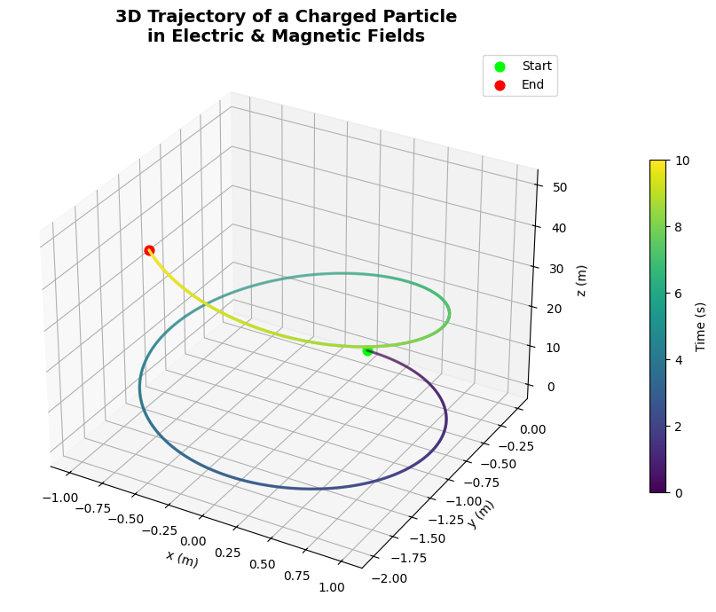

# **Simulating the Lorentz Force on a Charged Particle**

## 📌 Introduction

The motion of a charged particle in electric and magnetic fields is governed by the **Lorentz Force**:

$$
\mathbf{F} = q(\mathbf{E} + \mathbf{v} \times \mathbf{B})
$$

This principle underpins key technologies such as:

- Cyclotrons
- Mass spectrometers
- Magnetic traps
- Plasma confinement in fusion reactors

---

## ⚙️ Physical Parameters

To generate meaningful macroscopic simulations, we use:

- Charge: $q = 1\, \mathrm{C}$
- Mass: $m = 0.001\, \mathrm{kg}$ (i.e. $1\, \mathrm{g}$)
- Time interval: suitable range for visible motion (e.g., $10^{-3}\, \mathrm{s}$)
- Vector fields:
  - Electric field $\mathbf{E}$
  - Magnetic field $\mathbf{B}$
  - Initial velocity $\mathbf{v}_0$

---

## 📐 Equations of Motion

We solve the following system of ODEs numerically:

Let $\mathbf{r}$ be position, $\mathbf{v}$ be velocity:

$$
\frac{d\mathbf{r}}{dt} = \mathbf{v}
$$

$$
\frac{d\mathbf{v}}{dt} = \frac{q}{m} \left( \mathbf{E} + \mathbf{v} \times \mathbf{B} \right)
$$

We integrate this using Python's `solve_ivp()` method.

---

## 🔭 Scenarios and Trajectories

We simulate three representative cases:

### 1️⃣ Circular Motion

- Fields:
  - $\mathbf{E} = \mathbf{0}$
  - $\mathbf{B} = (0, 0, 1)\, \mathrm{T}$
- Initial velocity: perpendicular to $\mathbf{B}$

Expected behavior:
- Uniform circular motion in the $xy$-plane
- Radius: **Larmor radius**

$$
R = \frac{mv}{qB}
$$

---

### 2️⃣ Helical (Spiral) Motion

- Fields:
  - $\mathbf{E} = \mathbf{0}$
  - $\mathbf{B} = (0, 0, 1)\, \mathrm{T}$
- Initial velocity: not fully perpendicular (has $z$-component)

Expected behavior:
- Helical motion spiraling along $\mathbf{B}$-field
- Constant axial drift along $z$

---

### 3️⃣ Crossed Fields Drift

- Fields:
  - $\mathbf{E} = (10, 0, 0)\, \mathrm{V/m}$
  - $\mathbf{B} = (0, 0, 1)\, \mathrm{T}$
- Initial velocity: arbitrary

Expected behavior:
- Drift velocity:

$$
\mathbf{v}_d = \frac{\mathbf{E} \times \mathbf{B}}{B^2}
$$

- Trajectory shows sideways drift and possible curvature

---

## 🎨 Visualizations

For each scenario:
---

---

---


---
- ✅ 2D and 3D plots of trajectories
- ✅ Animation (GIF)
- ✅ Highlights:
  - Larmor radius
  - Direction of drift
  - Spiral axis
- ✅ Color-coded motion paths with labeled axes and time markers

---

## 🧠 Observations

- The magnetic field introduces circular or spiral constraints
- Electric field induces linear acceleration or drift
- Field configurations can be designed to trap or accelerate particles

---

## 🧰 Code Implementation

```python
import numpy as np
import matplotlib.pyplot as plt
from matplotlib.animation import FuncAnimation, PillowWriter
from scipy.integrate import solve_ivp
from IPython.display import Image, display

# Constants
q = 1.0  # Charge (C)
m = 1.0  # Mass (kg)
E = np.array([0.0, 0.0, 1.0])  # Electric field (V/m)
B = np.array([0.0, 0.0, 1.0])  # Magnetic field (T)

# Initial conditions
v0 = np.array([1.0, 0.0, 0.0])
r0 = np.array([0.0, 0.0, 0.0])
y0 = np.concatenate((r0, v0))

# Lorentz force function
def lorentz(t, y):
    r = y[:3]
    v = y[3:]
    dvdt = (q / m) * (E + np.cross(v, B))
    return np.concatenate((v, dvdt))

# Time settings
t_span = (0, 10)
t_eval = np.linspace(t_span[0], t_span[1], 500)
sol = solve_ivp(lorentz, t_span, y0, t_eval=t_eval)

x, y, z = sol.y[0], sol.y[1], sol.y[2]

# Set up the figure
fig, ax = plt.subplots(figsize=(6, 6))
ax.set_xlim(np.min(x)*1.1, np.max(x)*1.1)
ax.set_ylim(np.min(y)*1.1, np.max(y)*1.1)
ax.set_xlabel("x (m)")
ax.set_ylabel("y (m)")
ax.set_title("Charged Particle Motion in 2D (x-y plane)")
ax.grid(True)

line, = ax.plot([], [], lw=2, color='dodgerblue')
point, = ax.plot([], [], 'ro')

# Init function
def init():
    line.set_data([], [])
    point.set_data([], [])
    return line, point

# Update function
def update(i):
    if i < len(x):  # Ensure index is valid
        line.set_data(x[:i+1], y[:i+1])
        point.set_data([x[i]], [y[i]])  # Use lists to ensure sequence
        return line, point
    return line, point

# Create animation
ani = FuncAnimation(fig, update, frames=len(x), init_func=init, blit=False, interval=20)

# Save to GIF with explicit writer settings
gif_path = "charged_particle_motion.gif"
writer = PillowWriter(fps=30)
ani.save(gif_path, writer=writer, dpi=100)
plt.close()

# Display the GIF in Colab
display(Image(filename=gif_path))
```
---
```python
import numpy as np
import matplotlib.pyplot as plt
from scipy.integrate import solve_ivp
from mpl_toolkits.mplot3d import Axes3D
from matplotlib import cm

# Constants
q = 1.0
m = 1.0
E = np.array([0.0, 0.0, 1.0])
B = np.array([0.0, 0.0, 1.0])

# Initial conditions
v0 = np.array([1.0, 0.0, 0.0])
r0 = np.array([0.0, 0.0, 0.0])
y0 = np.concatenate((r0, v0))

# Lorentz force function
def lorentz(t, y):
    r = y[:3]
    v = y[3:]
    dvdt = (q / m) * (E + np.cross(v, B))
    return np.concatenate((v, dvdt))

# Solve system
t_span = (0, 10)
t_eval = np.linspace(*t_span, 1000)
sol = solve_ivp(lorentz, t_span, y0, t_eval=t_eval)
x, y, z = sol.y[0], sol.y[1], sol.y[2]
t = sol.t

# 3D Plot
fig = plt.figure(figsize=(10, 7))
ax = fig.add_subplot(111, projection='3d')
ax.plot(x, y, z, lw=2.5, c='gray', alpha=0.3)

scatter = ax.scatter(x, y, z, c=t, cmap='viridis', s=2)
ax.scatter(x[0], y[0], z[0], color='lime', label='Start', s=60)
ax.scatter(x[-1], y[-1], z[-1], color='red', label='End', s=60)

ax.set_xlabel('x (m)')
ax.set_ylabel('y (m)')
ax.set_zlabel('z (m)')
ax.set_title('3D Trajectory of a Charged Particle\nin Electric & Magnetic Fields', weight='bold', fontsize=14)
ax.legend()
fig.colorbar(scatter, ax=ax, label='Time (s)', shrink=0.6, pad=0.1)
plt.tight_layout()
plt.show()
```
---
```python
import numpy as np
import matplotlib.pyplot as plt
from scipy.integrate import solve_ivp
from matplotlib.collections import LineCollection

# Constants
q = 1.0
m = 1.0
E = np.array([0.0, 0.0, 0.0])
B = np.array([0.0, 0.0, 1.0])

# Initial conditions
v0 = np.array([1.0, 0.0, 0.0])
r0 = np.array([0.0, 0.0, 0.0])
y0 = np.concatenate((r0, v0))

# Lorentz force function
def lorentz(t, y):
    r = y[:3]
    v = y[3:]
    dvdt = (q / m) * (E + np.cross(v, B))
    return np.concatenate((v, dvdt))

# Time array
t_span = (0, 10)
t_eval = np.linspace(*t_span, 500)
sol = solve_ivp(lorentz, t_span, y0, t_eval=t_eval)
x, y = sol.y[0], sol.y[1]

# Build color gradient segments
points = np.array([x, y]).T.reshape(-1, 1, 2)
segments = np.concatenate([points[:-1], points[1:]], axis=1)
norm = plt.Normalize(t_eval.min(), t_eval.max())
lc = LineCollection(segments, cmap='plasma', norm=norm)
lc.set_array(t_eval)
lc.set_linewidth(2.5)

# Plot
fig, ax = plt.subplots(figsize=(8, 6))
ax.add_collection(lc)
ax.scatter(x[0], y[0], color='lime', label='Start', zorder=5)
ax.scatter(x[-1], y[-1], color='red', label='End', zorder=5)
ax.set_xlabel('x (m)')
ax.set_ylabel('y (m)')
ax.set_title('Color Gradient Trajectory of Charged Particle', weight='bold')
ax.axis('equal')
ax.legend()
plt.colorbar(lc, ax=ax, label='Time (s)')
plt.tight_layout()
plt.show()
```