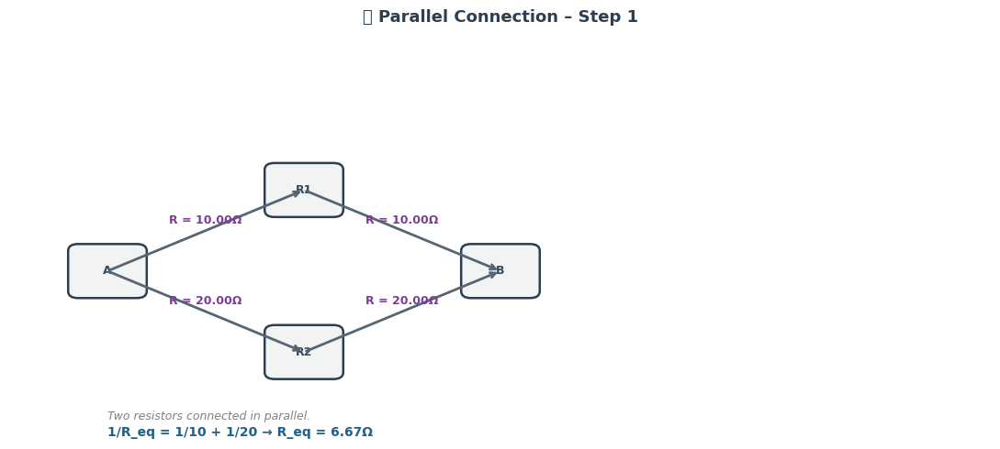
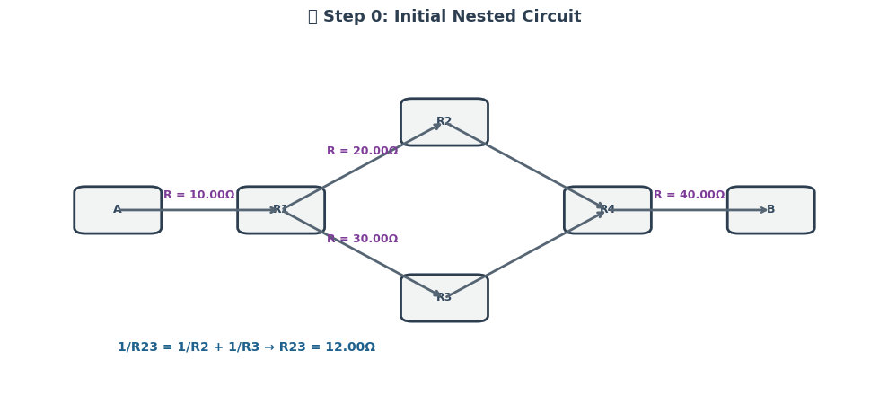
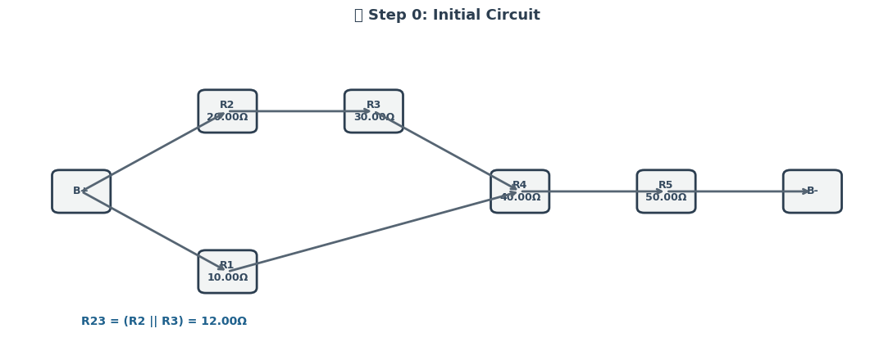
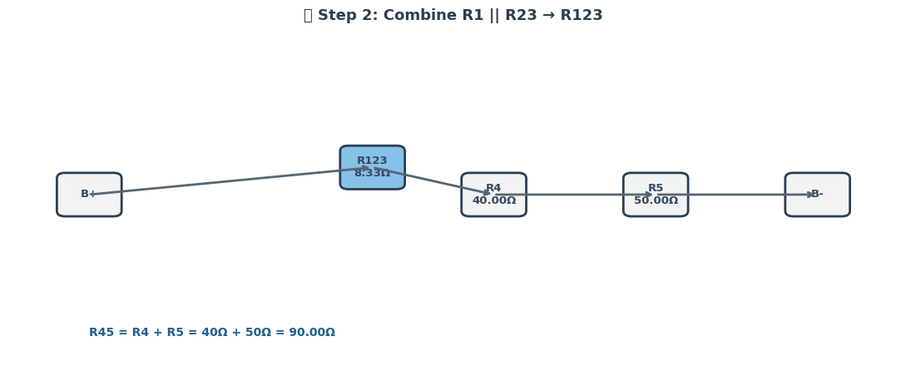
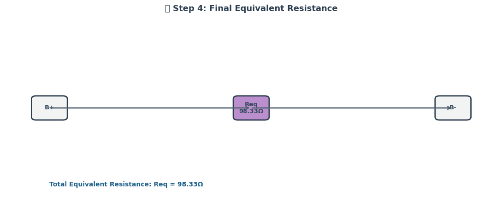
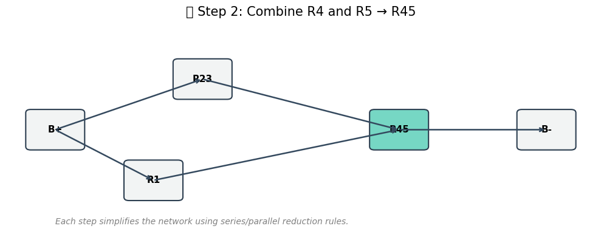
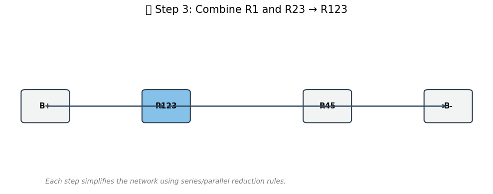
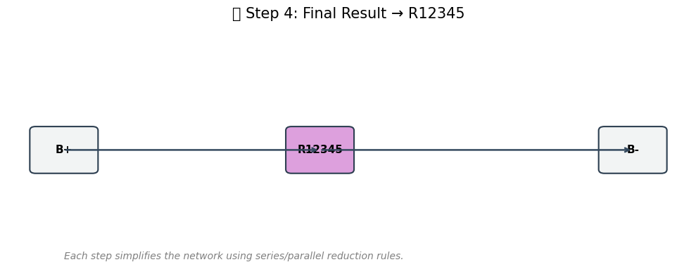
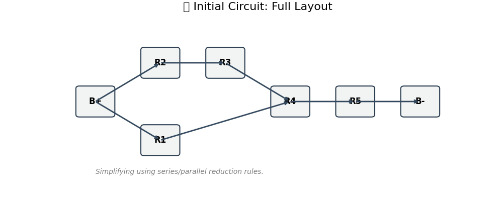

# 📘 Phase 1: Understanding the Concepts


## 🔌 Equivalent Resistance Rules

Understanding how resistors combine is fundamental before translating circuits into graph models.

### ➕ Series Connection

- Resistors are in **series** if they are connected end-to-end with no branching.
- The **equivalent resistance** is the **sum** of the individual resistances:

$$
R_{\text{eq(series)}} = R_1 + R_2 + R_3 + \dots + R_n
$$

- **Current** through each resistor is the same.
- **Voltage** divides across resistors.

---

### 🔁 Parallel Connection

- Resistors are in **parallel** if both ends are connected to the same two nodes.
- The reciprocal of the **equivalent resistance** is the **sum** of reciprocals:

$$
\frac{1}{R_{\text{eq(parallel)}}} = \frac{1}{R_1} + \frac{1}{R_2} + \frac{1}{R_3} + \dots + \frac{1}{R_n}
$$

- **Voltage** across each resistor is the same.

- **Current** divides among the resistors.

---

## 📈 Circuit-to-Graph Mapping


To apply graph theory, we convert the electrical circuit into a mathematical graph:

- **Nodes** represent **junctions** in the circuit.

- **Edges** represent **resistors**, with the edge **weight** equal to the resistor’s resistance (in ohms, $\Omega$).

### 🧠 Key Concepts

- A resistor between two junctions is modeled as an **undirected weighted edge** between two nodes.
- The full circuit becomes a **weighted undirected graph** $G = (V, E)$, where:

- $V$ is the set of junctions (vertices),

- $E$ is the set of resistors (edges with weights).

---

### ✅ Benefits of Graph Representation

- **Structured and algorithmic** simplification.
- Supports complex topologies and nested resistor configurations.
- Enables usage of algorithms from **graph theory**, such as traversal, cycle detection, and graph reduction.

---

## 🧭 Summary

By understanding how resistors combine and how to represent circuits as graphs, we lay the groundwork for designing an **algorithm** that can automate the process of finding equivalent resistance—even in complex, nested networks.

---

# ✅ Phase 2: Develop the Algorithm (Conceptual Level)


## 🔍 Objective

We aim to design an algorithm that calculates the **equivalent resistance** of a complex circuit represented as a **graph**. The method must iteratively **detect**, **simplify**, and **combine** resistors until the graph reduces to a single equivalent resistance between two terminals.

---

## 🧠 Key Concepts

### ➕ Series Connection Detection


---

- A **series** configuration occurs when:
  - Two resistors share a **common node** of **degree 2**.
  - No branching occurs at this node.
- The equivalent resistance for series:
  
  $$
  R_{\text{eq}} = R_1 + R_2
  $$

---

### 🔁 Parallel Connection Detection



---

- A **parallel** configuration exists when:
  - **Multiple edges** connect the **same pair of nodes**.
- The equivalent resistance for parallel:

$$
\frac{1}{R_{\text{eq}}} = \frac{1}{R_1} + \frac{1}{R_2} + \dots + \frac{1}{R_n}
$$

---

## 🔁 Iterative Graph Simplification

We apply the following logic **iteratively** until the entire graph reduces to a **single edge** representing the total equivalent resistance:

1. Detect **series** resistor pairs and combine.
2. Detect **parallel** resistor groups and combine.
3. Replace each group with its **equivalent resistance**.
4. Repeat until no more simplifications are possible.

---

## 🧾 Pseudocode: Resistance Reduction Algorithm

```pseudo
function compute_equivalent_resistance(graph G):
    while G has more than two nodes:
        for each node v in G:
            if degree(v) == 2:
                u, w = neighbors of v
                if edge(u, v) and edge(v, w) exist:
                    R1 = weight of edge(u, v)
                    R2 = weight of edge(v, w)
                    replace with edge(u, w) with weight R1 + R2
                    remove node v and its incident edges
        for each pair of nodes (u, v):
            if multiple edges exist between u and v:
                Let R1, R2, ..., Rn be the weights of all edges(u, v)
                compute R_eq using:
                    1 / R_eq = 1 / R1 + 1 / R2 + ... + 1 / Rn
                replace all edges(u, v) with a single edge of weight R_eq
    return weight of final edge between terminals
```

---

## 🔄 Handling Nested Combinations



---

- **Nested structures** (e.g. series within parallel) are simplified **recursively** or by **repeated iteration**.
- The graph is dynamically updated:
  - Merging two resistors may enable a new parallel pattern.
  - Re-check after each merge.

---


## ✅ Summary

This algorithm provides a robust and scalable method for calculating the **equivalent resistance** in arbitrary networks by:

- Modeling the circuit as a graph.
- Identifying structural patterns (series, parallel).
- Reducing them iteratively using physics-based rules.

The approach is suitable for both **manual analysis** and **automated implementations** in tools like Python with `networkx`.

---

# ✅ Phase 3: Work on Examples


## 🔍 Goal

To demonstrate how the algorithm simplifies real-world circuit cases, we analyze **three examples**:

1. Pure Series Resistors  
2. Pure Parallel Resistors  
3. Nested Configuration (Series and Parallel combined)

Each example includes a description, circuit logic, and a step-by-step simplification.

---

## 🔸 Example 1: Series Resistors

### 🧩 Description

Three resistors connected **in series** between two nodes A and D.

- **Components**:

- $R_1 = 5\ \Omega$

- $R_2 = 10\ \Omega$

 - $R_3 = 15\ \Omega$

- **Connection**: A — R₁ — B — R₂ — C — R₃ — D

### ⚙️ Simplification Logic

- Series resistors are **linearly connected**:
  
$$
R_{\text{eq}} = R_1 + R_2 + R_3 = 5 + 10 + 15 = 30\ \Omega
$$

- Algorithm detects each degree-2 node and collapses them iteratively:
  - Combine A–B and B–C into A–C
  - Then combine A–C and C–D into A–D

---

## 🔸 Example 2: Parallel Resistors

### 🧩 Description

Two resistors connected **in parallel** between nodes A and B.

- **Components**:

- $R_1 = 10\ \Omega$

- $R_2 = 20\ \Omega$

- **Connection**:
- Path 1: A → R₁ → B  

- Path 2: A → R₂ → B

### ⚙️ Simplification Logic

- Parallel resistors are connected across the **same two nodes**:

$$
\frac{1}{R_{\text{eq}}} = \frac{1}{10} + \frac{1}{20} = \frac{3}{20}
\Rightarrow R_{\text{eq}} = \frac{20}{3} \approx 6.67\ \Omega
$$

- Algorithm groups all edges between A and B, replaces them with the calculated equivalent resistance.

---

## 🔸 Example 3: Nested Configuration (Series + Parallel)

### 🧩 Description

- $R_1 = 5\ \Omega$ (A → B)  

- $R_2 = 10\ \Omega$ (B → C)  

- $R_3 = 20\ \Omega$ (B → C) — **parallel to R₂**  

- $R_4 = 5\ \Omega$ (C → D)

### 🛠 Structure:

- A — R₁ — B  
- B → R₂ → C  
- B → R₃ → C (in parallel with R₂)  
- C → R₄ → D

### ⚙️ Simplification Logic

1. **Parallel between B–C**:
$$
\frac{1}{R_{BC}} = \frac{1}{10} + \frac{1}{20} = \frac{3}{20}
\Rightarrow R_{BC} = \frac{20}{3} \approx 6.67\ \Omega
$$

2. **New path** becomes:

- A — R₁ — B — $R_{BC}$ — C — R₄ — D

3. **Series total**:

$$
R_{\text{eq}} = R_1 + R_{BC} + R_4 = 5 + \frac{20}{3} + 5 = \frac{50}{3} \approx 16.67\ \Omega
$$

- The algorithm reduces:

- Parallel group → replaces with $R_{BC}$

- Remaining series → collapsed step-by-step

## Visual



---


---


---


---



## ✅ Summary

| Type          | Formula Used                                 | Result             |
|---------------|-----------------------------------------------|--------------------|
| Series        | $R_{\text{eq}} = R_1 + R_2 + \dots + R_n$     | $30\ \Omega$       |
| Parallel      | $\frac{1}{R_{\text{eq}}} = \sum \frac{1}{R_i}$| $6.67\ \Omega$     |
| Nested        | Series + Parallel combination                 | $16.67\ \Omega$    |

These examples validate how graph-based simplification can be used to iteratively reduce circuits of arbitrary complexity using consistent rules and clear patterns.

--- 

# ✅ Phase 4: Analyze the Algorithm

---

## 📊 Efficiency Evaluation

Understanding the computational efficiency of the graph-based resistance simplification algorithm is key for scaling to large networks.

### 🔄 Number of Steps

- Let $n$ be the number of **nodes**, and $m$ be the number of **edges** (resistors).

- In the **worst case**, the algorithm performs:

- $O(n)$ passes for series simplifications.

- $O(m)$ checks for parallel edge reductions.

### 📉 Complexity of Series/Parallel Detection

#### ➕ Series Detection:

- For each node $v$:

- Check if $\text{deg}(v) = 2$

- Cost: $O(n)$ per pass

- If two neighbors $u$ and $w$ are connected to $v$:

- Combine $R_{uv}$ and $R_{vw}$ into $R_{uw}$

- Time per operation: $O(1)$

- **Total complexity** (series-only): $O(n^2)$ in worst case due to repeated passes.

#### 🔁 Parallel Detection:

- For each unordered pair of nodes $(u, v)$:
  - Collect all edges between them: $O(m)$
  - Reduce them using:

$$
\frac{1}{R_{\text{eq}}} = \sum_{i=1}^{k} \frac{1}{R_i}
$$

- **Total complexity** (parallel-only): $O(m^2)$ worst case for densely connected graphs.

---

## ⚠️ Limitations

### 🧩 Edge Cases & Complex Cycles

- The current algorithm assumes:
  - Graph is **connected**.
  - No **dependent sources** or **nonlinear elements** (e.g., capacitors, inductors).
- **Bridging nodes** (nodes that are part of multiple paths) may delay detection of simplification patterns.
- Circuits with **cycles that are not purely parallel** can be harder to simplify without advanced techniques (e.g., mesh analysis).

---


### 📈 Visualization 



---

## ✅ Summary

| Aspect              | Summary                                                                 |
|---------------------|-------------------------------------------------------------------------|
| Series Detection    | Fast per step, repeated passes required ($O(n^2)$ worst case)           |
| Parallel Detection  | Simple but costly in dense graphs ($O(m^2)$ worst case)                 |
| Limitations         | Cannot directly solve meshes, bridges, or nonlinear elements            |
| Improvements        | DFS, union-find, real-time animation, and better data structures        |

This phase ensures the algorithm isn't just **correct**, but also **efficient**, **scalable**, and **educationally valuable** in practice.

## Python Codes

```python
# 📘 Colab-ready animated circuit simplification (clean, labeled, and colorful)
import matplotlib.pyplot as plt
import matplotlib.patches as patches
import matplotlib.animation as animation

# Position layout of circuit elements
positions = {
    "B+": (0, 2),
    "R1": (2, 0.5),
    "R2": (2, 3.5),
    "R3": (4, 3.5),
    "R4": (6, 2),
    "R5": (8, 2),
    "R23": (3, 3.5),
    "R45": (7, 2),
    "R123": (3, 2),
    "R12345": (4.5, 2),
    "B-": (10, 2)
}

# Simplification steps
steps = [
    {
        "title": "🔰 Initial Circuit: Full Layout",
        "boxes": ["B+", "R1", "R2", "R3", "R4", "R5", "B-"],
        "lines": [("B+", "R2"), ("R2", "R3"), ("R3", "R4"),
                  ("B+", "R1"), ("R1", "R4"), ("R4", "R5"), ("R5", "B-")],
        "highlight": []
    },
    {
        "title": "🔁 Step 1: Combine R2 and R3 → R23",
        "boxes": ["B+", "R1", "R23", "R4", "R5", "B-"],
        "lines": [("B+", "R23"), ("R23", "R4"),
                  ("B+", "R1"), ("R1", "R4"), ("R4", "R5"), ("R5", "B-")],
        "highlight": ["R23"]
    },
    {
        "title": "🔁 Step 2: Combine R4 and R5 → R45",
        "boxes": ["B+", "R1", "R23", "R45", "B-"],
        "lines": [("B+", "R23"), ("R23", "R45"),
                  ("B+", "R1"), ("R1", "R45"), ("R45", "B-")],
        "highlight": ["R45"]
    },
    {
        "title": "🔁 Step 3: Combine R1 and R23 → R123",
        "boxes": ["B+", "R123", "R45", "B-"],
        "lines": [("B+", "R123"), ("R123", "R45"), ("R45", "B-")],
        "highlight": ["R123"]
    },
    {
        "title": "✅ Final Result: R12345",
        "boxes": ["B+", "R12345", "B-"],
        "lines": [("B+", "R12345"), ("R12345", "B-")],
        "highlight": ["R12345"]
    }
]

# Highlight color palette
highlight_colors = {
    "R23": "#FF6F61",
    "R45": "#76D7C4",
    "R123": "#85C1E9",
    "R12345": "#DDA0DD"
}

# Function to draw one frame
def draw_frame(i):
    step = steps[i]
    ax.clear()
    ax.set_xlim(-1, 11)
    ax.set_ylim(-1, 5)
    ax.axis("off")
    ax.set_title(step["title"], fontsize=16, pad=20)

    # Draw blocks
    for box in step["boxes"]:
        x, y = positions[box]
        color = highlight_colors.get(box, "#D6DBDF") if box in step["highlight"] else "#F2F4F4"
        rect = patches.FancyBboxPatch((x - 0.5, y - 0.5), 1, 1,
                                      boxstyle="round,pad=0.1", edgecolor="#2C3E50",
                                      facecolor=color, linewidth=1.5)
        ax.add_patch(rect)
        ax.text(x, y, box, ha="center", va="center", fontsize=12, weight="bold")

    # Draw arrows
    for u, v in step["lines"]:
        x1, y1 = positions[u]
        x2, y2 = positions[v]
        ax.annotate("",
                    xy=(x2, y2), xytext=(x1, y1),
                    arrowprops=dict(arrowstyle="->", lw=2, color="#34495E"))

    ax.text(0, -0.8, "Simplifying using series/parallel reduction rules.",
            fontsize=10, style='italic', color='gray')

# Create animation
fig, ax = plt.subplots(figsize=(10, 4))
ani = animation.FuncAnimation(fig, draw_frame, frames=len(steps), interval=1500, repeat=True)

# Save GIF
gif_path = "/content/circuit_simplification_animation.gif"
ani.save(gif_path, writer="pillow", fps=1)

print("✅ GIF saved to:", gif_path)
```
---

```python
# 📦 Series and Parallel Resistor Simplification (Clean Visuals)
import matplotlib.pyplot as plt
import matplotlib.patches as patches

# Node layout for both types
positions_series = {
    "A": (0, 2),
    "R1": (1.5, 2),
    "R2": (3, 2),
    "R3": (4.5, 2),
    "Req": (3, 2),
    "B": (6, 2)
}

positions_parallel = {
    "A": (0, 2),
    "R1": (1.5, 3),
    "R2": (1.5, 1),
    "Req": (1.5, 2),
    "B": (3, 2)
}

# Highlight color
highlight_color = {
    "Req": "#BB8FCE"
}

# Draw block-based circuit
def draw_circuit(title, boxes, lines, highlight=[], positions=None, note=""):
    fig, ax = plt.subplots(figsize=(8, 4))
    ax.set_xlim(-1, 7)
    ax.set_ylim(0, 4)
    ax.axis("off")
    ax.set_title(title, fontsize=14, pad=15)

    for node in boxes:
        x, y = positions[node]
        color = highlight_color.get(node, "#F2F4F4") if node in highlight else "#F2F4F4"
        rect = patches.FancyBboxPatch((x - 0.5, y - 0.5), 1, 1,
                                      boxstyle="round,pad=0.1", edgecolor="#2C3E50",
                                      facecolor=color, linewidth=1.5)
        ax.add_patch(rect)
        ax.text(x, y, node, ha="center", va="center", fontsize=11, weight="bold")

    for u, v in lines:
        x1, y1 = positions[u]
        x2, y2 = positions[v]
        ax.annotate("",
                    xy=(x2, y2), xytext=(x1, y1),
                    arrowprops=dict(arrowstyle="->", lw=1.8, color="#34495E"))

    if note:
        ax.text(0, 0.2, note, fontsize=10, style='italic', color='gray')

    plt.tight_layout()
    plt.show()


# 🔹 SERIES CONNECTION
# Step 1: Initial
draw_circuit(
    "🔰 Series Connection: Step 1 – R1 → R2 → R3",
    ["A", "R1", "R2", "R3", "B"],
    [("A", "R1"), ("R1", "R2"), ("R2", "R3"), ("R3", "B")],
    positions=positions_series,
    note="Three resistors connected end-to-end in series."
)

# Step 2: Simplified to Req
draw_circuit(
    "✅ Series Connection: Step 2 – Combine R1, R2, R3 → Req",
    ["A", "Req", "B"],
    [("A", "Req"), ("Req", "B")],
    highlight=["Req"],
    positions=positions_series,
    note="Equivalent resistance Req = R1 + R2 + R3"
)

# 🔸 PARALLEL CONNECTION
# Step 1: Initial
draw_circuit(
    "🔰 Parallel Connection: Step 1 – R1 || R2",
    ["A", "R1", "R2", "B"],
    [("A", "R1"), ("R1", "B"), ("A", "R2"), ("R2", "B")],
    positions=positions_parallel,
    note="R1 and R2 are both connected between A and B."
)

# Step 2: Simplified to Req
draw_circuit(
    "✅ Parallel Connection: Step 2 – Combine R1 || R2 → Req",
    ["A", "Req", "B"],
    [("A", "Req"), ("Req", "B")],
    highlight=["Req"],
    positions=positions_parallel,
    note="Equivalent: 1/Req = 1/R1 + 1/R2"
)
```
---

```python
# 🔁 Nested Combination Circuit Simplification - Colab Ready
import matplotlib.pyplot as plt
import matplotlib.patches as patches

# Layout positions for nested structure
positions = {
    "A": (0, 2),
    "R1": (1.5, 2),
    "R2": (3, 3.5),
    "R3": (3, 0.5),
    "R23": (3, 2),
    "R4": (4.5, 2),
    "R123": (2.25, 2),
    "R1234": (3.75, 2),
    "B": (6, 2)
}

# Define nested steps
steps = [
    {
        "title": "🔰 Initial Nested Circuit",
        "boxes": ["A", "R1", "R2", "R3", "R4", "B"],
        "lines": [("A", "R1"), ("R1", "R2"), ("R1", "R3"),
                  ("R2", "R4"), ("R3", "R4"), ("R4", "B")],
        "highlight": []
    },
    {
        "title": "🔁 Step 1: R2 and R3 in Parallel → R23",
        "boxes": ["A", "R1", "R23", "R4", "B"],
        "lines": [("A", "R1"), ("R1", "R23"), ("R23", "R4"), ("R4", "B")],
        "highlight": ["R23"]
    },
    {
        "title": "🔁 Step 2: R1 and R23 in Series → R123",
        "boxes": ["A", "R123", "R4", "B"],
        "lines": [("A", "R123"), ("R123", "R4"), ("R4", "B")],
        "highlight": ["R123"]
    },
    {
        "title": "✅ Step 3: R123 and R4 in Series → R1234",
        "boxes": ["A", "R1234", "B"],
        "lines": [("A", "R1234"), ("R1234", "B")],
        "highlight": ["R1234"]
    }
]

# Highlight colors for merged resistors
highlight_colors = {
    "R23": "#F1948A",     # soft red
    "R123": "#5DADE2",    # soft blue
    "R1234": "#BB8FCE"    # purple
}

# Draw each step
def draw_nested_step(step):
    fig, ax = plt.subplots(figsize=(9, 4))
    ax.set_xlim(-1, 7)
    ax.set_ylim(-1, 5)
    ax.axis("off")
    ax.set_title(step["title"], fontsize=15, pad=15)

    # Draw nodes
    for box in step["boxes"]:
        x, y = positions[box]
        color = highlight_colors.get(box, "#D6DBDF") if box in step["highlight"] else "#F2F4F4"
        rect = patches.FancyBboxPatch((x - 0.5, y - 0.5), 1, 1,
                                      boxstyle="round,pad=0.1", edgecolor="#2C3E50",
                                      facecolor=color, linewidth=1.5)
        ax.add_patch(rect)
        ax.text(x, y, box, ha="center", va="center", fontsize=11, weight="bold")

    # Draw arrows
    for u, v in step["lines"]:
        x1, y1 = positions[u]
        x2, y2 = positions[v]
        ax.annotate("",
                    xy=(x2, y2), xytext=(x1, y1),
                    arrowprops=dict(arrowstyle="->", lw=1.8, color="#34495E"))

    ax.text(0, -0.8, "Nested structure: R2 || R3 → R23, then in series with R1 and R4.",
            fontsize=10, style='italic', color='gray')
    plt.tight_layout()
    plt.show()

# Show all nested steps
for step in steps:
    draw_nested_step(step)
```
---

```python
# 📘 Colab-ready enhanced visualization of circuit simplification steps
import matplotlib.pyplot as plt
import matplotlib.patches as patches

# Position layout
positions = {
    "B+": (0, 2),
    "R1": (2, 0.5),
    "R2": (2, 3.5),
    "R3": (4, 3.5),
    "R4": (6, 2),
    "R5": (8, 2),
    "R23": (3, 3.5),
    "R45": (7, 2),
    "R123": (3, 2),
    "R12345": (4.5, 2),
    "B-": (10, 2)
}

# Steps of simplification
steps = [
    {
        "title": "🔰 Initial Circuit: Full Layout",
        "boxes": ["B+", "R1", "R2", "R3", "R4", "R5", "B-"],
        "lines": [("B+", "R2"), ("R2", "R3"), ("R3", "R4"),
                  ("B+", "R1"), ("R1", "R4"), ("R4", "R5"), ("R5", "B-")],
        "highlight": []
    },
    {
        "title": "🔁 Step 1: Combine R2 and R3 → R23",
        "boxes": ["B+", "R1", "R23", "R4", "R5", "B-"],
        "lines": [("B+", "R23"), ("R23", "R4"),
                  ("B+", "R1"), ("R1", "R4"), ("R4", "R5"), ("R5", "B-")],
        "highlight": ["R23"]
    },
    {
        "title": "🔁 Step 2: Combine R4 and R5 → R45",
        "boxes": ["B+", "R1", "R23", "R45", "B-"],
        "lines": [("B+", "R23"), ("R23", "R45"),
                  ("B+", "R1"), ("R1", "R45"), ("R45", "B-")],
        "highlight": ["R45"]
    },
    {
        "title": "🔁 Step 3: Combine R1 and R23 → R123",
        "boxes": ["B+", "R123", "R45", "B-"],
        "lines": [("B+", "R123"), ("R123", "R45"), ("R45", "B-")],
        "highlight": ["R123"]
    },
    {
        "title": "✅ Step 4: Final Result → R12345",
        "boxes": ["B+", "R12345", "B-"],
        "lines": [("B+", "R12345"), ("R12345", "B-")],
        "highlight": ["R12345"]
    }
]

# Highlight colors
highlight_colors = {
    "R23": "#FF6F61",      # orange red
    "R45": "#76D7C4",      # mint
    "R123": "#85C1E9",     # sky blue
    "R12345": "#DDA0DD"    # orchid
}

# Drawing function
def draw_step(step):
    fig, ax = plt.subplots(figsize=(10, 4))
    ax.set_xlim(-1, 11)
    ax.set_ylim(-1, 5)
    ax.axis("off")
    ax.set_title(step["title"], fontsize=15, pad=15)

    # Draw blocks
    for box in step["boxes"]:
        x, y = positions[box]
        color = highlight_colors.get(box, "#D6DBDF") if box in step["highlight"] else "#F2F4F4"
        rect = patches.FancyBboxPatch((x - 0.5, y - 0.5), 1, 1,
                                      boxstyle="round,pad=0.1", edgecolor="#2C3E50",
                                      facecolor=color, linewidth=1.5)
        ax.add_patch(rect)
        ax.text(x, y, box, ha="center", va="center", fontsize=11, weight="bold")

    # Draw arrows
    for u, v in step["lines"]:
        x1, y1 = positions[u]
        x2, y2 = positions[v]
        ax.annotate("",
                    xy=(x2, y2), xytext=(x1, y1),
                    arrowprops=dict(arrowstyle="->", lw=1.8, color="#34495E"))

    # Optional: description text below
    ax.text(0, -0.8, "Each step simplifies the network using series/parallel reduction rules.",
            fontsize=10, style='italic', color='gray')

    plt.tight_layout()
    plt.show()

# Draw each step
for step in steps:
    draw_step(step)
```


