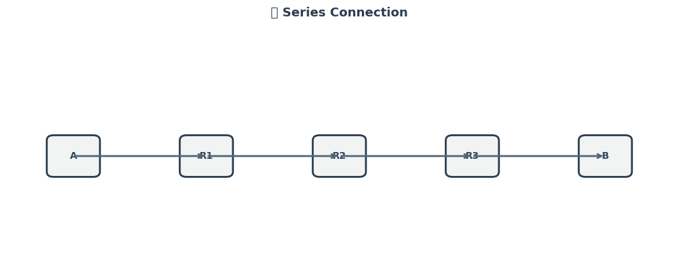
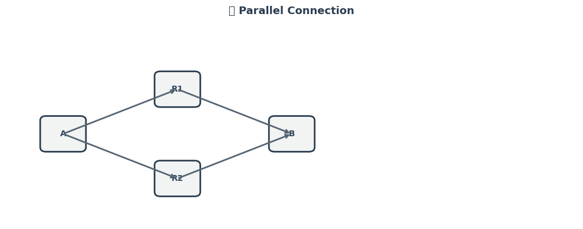
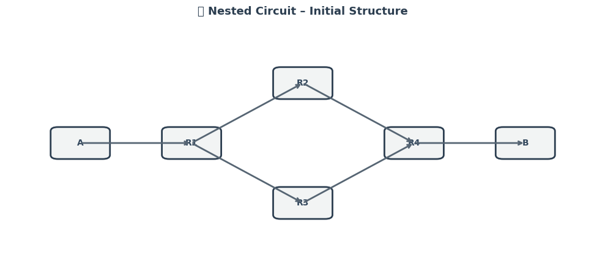
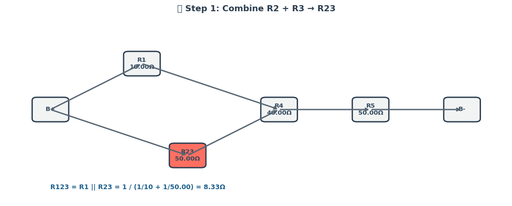
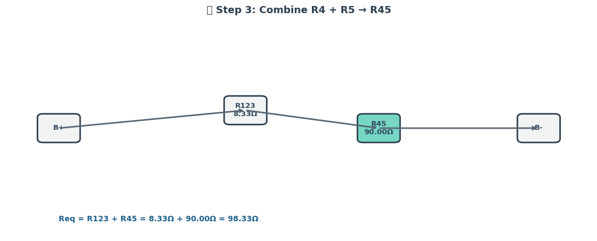

# 📘 Phase 1: Understanding the Concepts


## 🔌 Equivalent Resistance Rules

Understanding how resistors combine is fundamental before translating circuits into graph models.

### ➕ Series Connection

- Resistors are in **series** if they are connected end-to-end with no branching.
- The **equivalent resistance** is the **sum** of the individual resistances:

$$
R_{\text{eq(series)}} = R_1 + R_2 + R_3 + \dots + R_n
$$

- **Current** through each resistor is the same.
- **Voltage** divides across resistors.

---

### 🔁 Parallel Connection

- Resistors are in **parallel** if both ends are connected to the same two nodes.
- The reciprocal of the **equivalent resistance** is the **sum** of reciprocals:

$$
\frac{1}{R_{\text{eq(parallel)}}} = \frac{1}{R_1} + \frac{1}{R_2} + \frac{1}{R_3} + \dots + \frac{1}{R_n}
$$

- **Voltage** across each resistor is the same.

- **Current** divides among the resistors.

---

## 📈 Circuit-to-Graph Mapping


To apply graph theory, we convert the electrical circuit into a mathematical graph:

- **Nodes** represent **junctions** in the circuit.

- **Edges** represent **resistors**, with the edge **weight** equal to the resistor’s resistance (in ohms, $\Omega$).

### 🧠 Key Concepts

- A resistor between two junctions is modeled as an **undirected weighted edge** between two nodes.
- The full circuit becomes a **weighted undirected graph** $G = (V, E)$, where:

- $V$ is the set of junctions (vertices),

- $E$ is the set of resistors (edges with weights).

---

### ✅ Benefits of Graph Representation

- **Structured and algorithmic** simplification.
- Supports complex topologies and nested resistor configurations.
- Enables usage of algorithms from **graph theory**, such as traversal, cycle detection, and graph reduction.

---

## 🧭 Summary

By understanding how resistors combine and how to represent circuits as graphs, we lay the groundwork for designing an **algorithm** that can automate the process of finding equivalent resistance—even in complex, nested networks.

---

# ✅ Phase 2: Develop the Algorithm (Conceptual Level)


## 🔍 Objective

We aim to design an algorithm that calculates the **equivalent resistance** of a complex circuit represented as a **graph**. The method must iteratively **detect**, **simplify**, and **combine** resistors until the graph reduces to a single equivalent resistance between two terminals.

---

## 🧠 Key Concepts

### ➕ Series Connection Detection


---

- A **series** configuration occurs when:
  - Two resistors share a **common node** of **degree 2**.
  - No branching occurs at this node.
- The equivalent resistance for series:
  
  $$
  R_{\text{eq}} = R_1 + R_2
  $$

---

### 🔁 Parallel Connection Detection



---

- A **parallel** configuration exists when:
  - **Multiple edges** connect the **same pair of nodes**.
- The equivalent resistance for parallel:

$$
\frac{1}{R_{\text{eq}}} = \frac{1}{R_1} + \frac{1}{R_2} + \dots + \frac{1}{R_n}
$$

---

## 🔁 Iterative Graph Simplification

We apply the following logic **iteratively** until the entire graph reduces to a **single edge** representing the total equivalent resistance:

1. Detect **series** resistor pairs and combine.
2. Detect **parallel** resistor groups and combine.
3. Replace each group with its **equivalent resistance**.
4. Repeat until no more simplifications are possible.


---

## 🔄 Handling Nested Combinations


---

- **Nested structures** (e.g. series within parallel) are simplified **recursively** or by **repeated iteration**.
- The graph is dynamically updated:
  - Merging two resistors may enable a new parallel pattern.
  - Re-check after each merge.

---


## ✅ Summary

This algorithm provides a robust and scalable method for calculating the **equivalent resistance** in arbitrary networks by:

- Modeling the circuit as a graph.
- Identifying structural patterns (series, parallel).
- Reducing them iteratively using physics-based rules.

The approach is suitable for both **manual analysis** and **automated implementations** in tools like Python with `networkx`.

---

# ✅ Phase 3: Work on Examples


## 🔍 Goal

To demonstrate how the algorithm simplifies real-world circuit cases, we analyze **three examples**:

1. Pure Series Resistors  
2. Pure Parallel Resistors  
3. Nested Configuration (Series and Parallel combined)

Each example includes a description, circuit logic, and a step-by-step simplification.

---

## 🔸 Example 1: Series Resistors

### 🧩 Description

Three resistors connected **in series** between two nodes A and D.

- **Components**:

- $R_1 = 5\ \Omega$

- $R_2 = 10\ \Omega$

 - $R_3 = 15\ \Omega$

- **Connection**: A — R₁ — B — R₂ — C — R₃ — D

### ⚙️ Simplification Logic

- Series resistors are **linearly connected**:
  
$$
R_{\text{eq}} = R_1 + R_2 + R_3 = 5 + 10 + 15 = 30\ \Omega
$$

- Algorithm detects each degree-2 node and collapses them iteratively:
  - Combine A–B and B–C into A–C
  - Then combine A–C and C–D into A–D

---

## 🔸 Example 2: Parallel Resistors

### 🧩 Description

Two resistors connected **in parallel** between nodes A and B.

- **Components**:

- $R_1 = 10\ \Omega$

- $R_2 = 20\ \Omega$

- **Connection**:
- Path 1: A → R₁ → B  

- Path 2: A → R₂ → B

### ⚙️ Simplification Logic

- Parallel resistors are connected across the **same two nodes**:

$$
\frac{1}{R_{\text{eq}}} = \frac{1}{10} + \frac{1}{20} = \frac{3}{20}
\Rightarrow R_{\text{eq}} = \frac{20}{3} \approx 6.67\ \Omega
$$

- Algorithm groups all edges between A and B, replaces them with the calculated equivalent resistance.

---

## 🔸 Example 3: Nested Configuration (Series + Parallel)

### 🧩 Description

- $R_1 = 5\ \Omega$ (A → B)  

- $R_2 = 10\ \Omega$ (B → C)  

- $R_3 = 20\ \Omega$ (B → C) — **parallel to R₂**  

- $R_4 = 5\ \Omega$ (C → D)

### 🛠 Structure:

- A — R₁ — B  
- B → R₂ → C  
- B → R₃ → C (in parallel with R₂)  
- C → R₄ → D

### ⚙️ Simplification Logic

1. **Parallel between B–C**:
$$
\frac{1}{R_{BC}} = \frac{1}{10} + \frac{1}{20} = \frac{3}{20}
\Rightarrow R_{BC} = \frac{20}{3} \approx 6.67\ \Omega
$$

2. **New path** becomes:

- A — R₁ — B — $R_{BC}$ — C — R₄ — D

3. **Series total**:

$$
R_{\text{eq}} = R_1 + R_{BC} + R_4 = 5 + \frac{20}{3} + 5 = \frac{50}{3} \approx 16.67\ \Omega
$$

- The algorithm reduces:

- Parallel group → replaces with $R_{BC}$

- Remaining series → collapsed step-by-step

## Visual


---



---


---



---


## ✅ Summary

| Type          | Formula Used                                 | Result             |
|---------------|-----------------------------------------------|--------------------|
| Series        | $R_{\text{eq}} = R_1 + R_2 + \dots + R_n$     | $30\ \Omega$       |
| Parallel      | $\frac{1}{R_{\text{eq}}} = \sum \frac{1}{R_i}$| $6.67\ \Omega$     |
| Nested        | Series + Parallel combination                 | $16.67\ \Omega$    |

These examples validate how graph-based simplification can be used to iteratively reduce circuits of arbitrary complexity using consistent rules and clear patterns.

--- 

# ✅ Phase 4: Analyze the Algorithm

---

## 📊 Efficiency Evaluation

Understanding the computational efficiency of the graph-based resistance simplification algorithm is key for scaling to large networks.

### 🔄 Number of Steps

- Let $n$ be the number of **nodes**, and $m$ be the number of **edges** (resistors).

- In the **worst case**, the algorithm performs:

- $O(n)$ passes for series simplifications.

- $O(m)$ checks for parallel edge reductions.

### 📉 Complexity of Series/Parallel Detection

#### ➕ Series Detection:

- For each node $v$:

- Check if $\text{deg}(v) = 2$

- Cost: $O(n)$ per pass

- If two neighbors $u$ and $w$ are connected to $v$:

- Combine $R_{uv}$ and $R_{vw}$ into $R_{uw}$

- Time per operation: $O(1)$

- **Total complexity** (series-only): $O(n^2)$ in worst case due to repeated passes.

#### 🔁 Parallel Detection:

- For each unordered pair of nodes $(u, v)$:
  - Collect all edges between them: $O(m)$
  - Reduce them using:

$$
\frac{1}{R_{\text{eq}}} = \sum_{i=1}^{k} \frac{1}{R_i}
$$

- **Total complexity** (parallel-only): $O(m^2)$ worst case for densely connected graphs.

---

## ⚠️ Limitations

### 🧩 Edge Cases & Complex Cycles

- The current algorithm assumes:
  - Graph is **connected**.
  - No **dependent sources** or **nonlinear elements** (e.g., capacitors, inductors).
- **Bridging nodes** (nodes that are part of multiple paths) may delay detection of simplification patterns.
- Circuits with **cycles that are not purely parallel** can be harder to simplify without advanced techniques (e.g., mesh analysis).

---


### 📈 Visualization 

.gif>)

---

## ✅ Summary

| Aspect              | Summary                                                                 |
|---------------------|-------------------------------------------------------------------------|
| Series Detection    | Fast per step, repeated passes required ($O(n^2)$ worst case)           |
| Parallel Detection  | Simple but costly in dense graphs ($O(m^2)$ worst case)                 |
| Limitations         | Cannot directly solve meshes, bridges, or nonlinear elements            |
| Improvements        | DFS, union-find, real-time animation, and better data structures        |

This phase ensures the algorithm isn't just **correct**, but also **efficient**, **scalable**, and **educationally valuable** in practice.

## Python Codes

```python
# 📦 Install required package (if not already available)
!pip install imageio --quiet

import matplotlib.pyplot as plt
import matplotlib.patches as patches
import imageio.v2 as imageio
import os

# === Setup ===
output_folder = "frames"
gif_name = "circuit_animation.gif"
os.makedirs(output_folder, exist_ok=True)

# Resistor values
resistor_values = {
    "R1": 10,
    "R2": 20,
    "R3": 30,
    "R4": 40,
    "R5": 50,
    "R23": 1 / (1 / 20 + 1 / 30),             # ≈12
    "R45": 40 + 50,                           # 90
    "R123": 10 + (1 / (1 / 20 + 1 / 30)),     # ≈22
    "R12345": 10 + (1 / (1 / 20 + 1 / 30)) + 40 + 50  # ≈112
}

# Node positions
positions = {
    "B+": (0, 2),
    "R1": (2, 0.5),
    "R2": (2, 3.5),
    "R3": (4, 3.5),
    "R4": (6, 2),
    "R5": (8, 2),
    "R23": (3, 3.5),
    "R45": (7, 2),
    "R123": (3, 2),
    "R12345": (4.5, 2),
    "B-": (10, 2)
}

# Circuit simplification steps
steps = [
    {
        "title": "🔰 Step 0: Initial Circuit",
        "boxes": ["B+", "R1", "R2", "R3", "R4", "R5", "B-"],
        "lines": [("B+", "R2"), ("R2", "R3"), ("R3", "R4"),
                  ("B+", "R1"), ("R1", "R4"), ("R4", "R5"), ("R5", "B-")],
        "highlight": [],
        "formula": "R23 = (R2 || R3) = 12.00Ω"
    },
    {
        "title": "🔁 Step 1: Combine R2 || R3 → R23",
        "boxes": ["B+", "R1", "R23", "R4", "R5", "B-"],
        "lines": [("B+", "R23"), ("R23", "R4"),
                  ("B+", "R1"), ("R1", "R4"), ("R4", "R5"), ("R5", "B-")],
        "highlight": ["R23"],
        "formula": "R45 = R4 + R5 = 90.00Ω"
    },
    {
        "title": "🔁 Step 2: Combine R4 + R5 → R45",
        "boxes": ["B+", "R1", "R23", "R45", "B-"],
        "lines": [("B+", "R23"), ("R23", "R45"),
                  ("B+", "R1"), ("R1", "R45"), ("R45", "B-")],
        "highlight": ["R45"],
        "formula": "R123 = R1 + R23 = 22.00Ω"
    },
    {
        "title": "🔁 Step 3: Combine R1 + R23 → R123",
        "boxes": ["B+", "R123", "R45", "B-"],
        "lines": [("B+", "R123"), ("R123", "R45"), ("R45", "B-")],
        "highlight": ["R123"],
        "formula": "R12345 = R123 + R45 = 112.00Ω"
    },
    {
        "title": "✅ Step 4: Final Equivalent Resistance",
        "boxes": ["B+", "R12345", "B-"],
        "lines": [("B+", "R12345"), ("R12345", "B-")],
        "highlight": ["R12345"],
        "formula": "R_eq = 112.00Ω"
    }
]

# Colors for highlighted resistors
highlight_colors = {
    "R23": "#FF6F61",
    "R45": "#76D7C4",
    "R123": "#85C1E9",
    "R12345": "#DDA0DD"
}

# Drawing function
def draw_step(step, step_idx):
    fig, ax = plt.subplots(figsize=(11, 4.5))
    ax.set_xlim(-1, 11)
    ax.set_ylim(-1, 5)
    ax.axis("off")
    ax.set_title(step["title"], fontsize=13, weight='bold', pad=10, color="#2C3E50")

    # Draw resistor boxes
    for box in step["boxes"]:
        x, y = positions[box]
        color = highlight_colors.get(box, "#D6DBDF") if box in step["highlight"] else "#F2F4F4"
        rect = patches.FancyBboxPatch((x - 0.3, y - 0.3), 0.6, 0.6,
                                      boxstyle="round,pad=0.1", edgecolor="#2C3E50",
                                      facecolor=color, linewidth=2)
        ax.add_patch(rect)
        label = f"{box}\n{resistor_values[box]:.2f}Ω" if box in resistor_values else box
        ax.text(x, y, label, ha="center", va="center", fontsize=9, weight="bold", color="#34495E")

    # Draw connections
    for u, v in step["lines"]:
        x1, y1 = positions[u]
        x2, y2 = positions[v]
        ax.annotate("", xy=(x2, y2), xytext=(x1, y1),
                    arrowprops=dict(arrowstyle="->", lw=2, color="#566573"))

    # Formula under the diagram
    ax.text(0, -0.5, step["formula"], fontsize=10, weight='bold', color='#1F618D')
    plt.tight_layout()

    # Save frame
    path = os.path.join(output_folder, f"step_{step_idx}.png")
    fig.savefig(path)
    plt.close(fig)
    return path

# Generate images
image_paths = [draw_step(step, i) for i, step in enumerate(steps)]

# Create GIF (15 fps, but each frame held 45 frames ≈ 3 seconds)
frames = []
for img_path in image_paths:
    frame = imageio.imread(img_path)
    frames.extend([frame] * 45)  # 15 fps × 3 seconds = 45 copies

imageio.mimsave(gif_name, frames, fps=15)
print("✅ GIF created successfully!")

# Show GIF in Colab
from IPython.display import Image
Image(filename=gif_name)
```
---

```python
import matplotlib.pyplot as plt
import matplotlib.patches as patches

# === Setup resistor names ===
resistor_names_series = ["R1", "R2", "R3"]
resistor_names_parallel = ["R1", "R2"]

# === Node positions ===
positions_series = {
    "A": (0, 2),
    "R1": (2, 2),
    "R2": (4, 2),
    "R3": (6, 2),
    "B": (8, 2)
}

positions_parallel = {
    "A": (0, 2),
    "R1": (2, 3),
    "R2": (2, 1),
    "B": (4, 2)
}

# === Drawing function (no values shown) ===
def draw_circuit_no_values(title, boxes, lines, positions):
    fig, ax = plt.subplots(figsize=(10, 4))
    ax.set_xlim(-1, 9)
    ax.set_ylim(0, 4.5)
    ax.axis("off")
    ax.set_title(title, fontsize=13, pad=10, weight='bold', color="#2C3E50")

    for box in boxes:
        x, y = positions[box]
        rect = patches.FancyBboxPatch(
            (x - 0.3, y - 0.3), 0.6, 0.6,
            boxstyle="round,pad=0.1",
            edgecolor="#2C3E50",
            facecolor="#F2F4F4",
            linewidth=2
        )
        ax.add_patch(rect)
        ax.text(x, y, box, ha="center", va="center", fontsize=10, weight="bold", color="#34495E")

    for u, v in lines:
        x1, y1 = positions[u]
        x2, y2 = positions[v]
        ax.annotate("",
                    xy=(x2, y2), xytext=(x1, y1),
                    arrowprops=dict(arrowstyle="->", lw=2, color="#566573"))

    plt.tight_layout()
    plt.show()

# === Series Connection ===
draw_circuit_no_values(
    title="🔗 Series Connection",
    boxes=["A"] + resistor_names_series + ["B"],
    lines=[("A", "R1"), ("R1", "R2"), ("R2", "R3"), ("R3", "B")],
    positions=positions_series
)

# === Parallel Connection ===
draw_circuit_no_values(
    title="🔀 Parallel Connection",
    boxes=["A", "R1", "R2", "B"],
    lines=[("A", "R1"), ("R1", "B"), ("A", "R2"), ("R2", "B")],
    positions=positions_parallel
)
```
---

```python
# ✅ Final Nested Circuit Simplification with R = xxΩ Labels (Colab-ready)
import matplotlib.pyplot as plt
import matplotlib.patches as patches

# Node positions for nested circuit
positions = {
    "A": (0, 2),
    "R1": (1.5, 2),
    "R2": (3, 3.5),
    "R3": (3, 0.5),
    "R4": (4.5, 2),
    "B": (6, 2)
}

# Boxes and connections for the initial nested circuit
boxes = ["A", "R1", "R2", "R3", "R4", "B"]
lines = [
    ("A", "R1"),
    ("R1", "R2"),
    ("R1", "R3"),
    ("R2", "R4"),
    ("R3", "R4"),
    ("R4", "B")
]

# Drawing function (no values)
def draw_nested_schematic(title, boxes, lines, positions):
    fig, ax = plt.subplots(figsize=(10, 4.5))
    ax.set_xlim(-1, 7)
    ax.set_ylim(-1, 5)
    ax.axis("off")
    ax.set_title(title, fontsize=13, pad=10, weight='bold', color="#2C3E50")

    for box in boxes:
        x, y = positions[box]
        rect = patches.FancyBboxPatch((x - 0.3, y - 0.3), 0.6, 0.6,
                                      boxstyle="round,pad=0.1",
                                      edgecolor="#2C3E50",
                                      facecolor="#F2F4F4",
                                      linewidth=2)
        ax.add_patch(rect)
        ax.text(x, y, box, ha="center", va="center", fontsize=10, weight="bold", color="#34495E")

    for u, v in lines:
        x1, y1 = positions[u]
        x2, y2 = positions[v]
        ax.annotate("", xy=(x2, y2), xytext=(x1, y1),
                    arrowprops=dict(arrowstyle="->", lw=2, color="#566573"))

    plt.tight_layout()
    plt.show()

# Draw only the initial nested schematic
draw_nested_schematic(
    title="🔰 Nested Circuit – Initial Structure",
    boxes=boxes,
    lines=lines,
    positions=positions
)
p)
```
---

```python
import matplotlib.pyplot as plt
import matplotlib.patches as patches

# Ohm values
resistor_values = {
    "R1": 10,
    "R2": 20,
    "R3": 30,
    "R4": 40,
    "R5": 50,
    "R23": 1 / (1 / 20 + 1 / 30),             # ≈12
    "R45": 40 + 50,                           # 90
    "R123": 10 + (1 / (1 / 20 + 1 / 30)),     # ≈22
    "R12345": 10 + (1 / (1 / 20 + 1 / 30)) + 40 + 50  # ≈112
}

# Node positions
positions = {
    "B+": (0, 2),
    "R1": (2, 0.5),
    "R2": (2, 3.5),
    "R3": (4, 3.5),
    "R4": (6, 2),
    "R5": (8, 2),
    "R23": (3, 3.5),
    "R45": (7, 2),
    "R123": (3, 2),
    "R12345": (4.5, 2),
    "B-": (10, 2)
}

# Circuit simplification steps
steps = [
    {
        "title": "🔰 Step 0: Initial Circuit",
        "boxes": ["B+", "R1", "R2", "R3", "R4", "R5", "B-"],
        "lines": [("B+", "R2"), ("R2", "R3"), ("R3", "R4"),
                  ("B+", "R1"), ("R1", "R4"), ("R4", "R5"), ("R5", "B-")],
        "highlight": [],
        "formula": "R23 = (R2 || R3) = 12.00Ω"
    },
    {
        "title": "🔁 Step 1: Combine R2 || R3 → R23",
        "boxes": ["B+", "R1", "R23", "R4", "R5", "B-"],
        "lines": [("B+", "R23"), ("R23", "R4"),
                  ("B+", "R1"), ("R1", "R4"), ("R4", "R5"), ("R5", "B-")],
        "highlight": ["R23"],
        "formula": "R45 = R4 + R5 = 40Ω + 50Ω = 90.00Ω"
    },
    {
        "title": "🔁 Step 2: Combine R4 + R5 → R45",
        "boxes": ["B+", "R1", "R23", "R45", "B-"],
        "lines": [("B+", "R23"), ("R23", "R45"),
                  ("B+", "R1"), ("R1", "R45"), ("R45", "B-")],
        "highlight": ["R45"],
        "formula": "R123 = R1 + R23 = 10Ω + 12Ω = 22.00Ω"
    },
    {
        "title": "🔁 Step 3: Combine R1 + R23 → R123",
        "boxes": ["B+", "R123", "R45", "B-"],
        "lines": [("B+", "R123"), ("R123", "R45"), ("R45", "B-")],
        "highlight": ["R123"],
        "formula": "R12345 = R123 + R45 = 22Ω + 90Ω = 112.00Ω"
    },
    {
        "title": "✅ Step 4: Final Equivalent Resistance",
        "boxes": ["B+", "R12345", "B-"],
        "lines": [("B+", "R12345"), ("R12345", "B-")],
        "highlight": ["R12345"],
        "formula": "R_eq = 112.00Ω"
    }
]

highlight_colors = {
    "R23": "#FF6F61",
    "R45": "#76D7C4",
    "R123": "#85C1E9",
    "R12345": "#DDA0DD"
}

# Drawing function
def draw_step(step):
    fig, ax = plt.subplots(figsize=(11, 4.5))
    ax.set_xlim(-1, 11)
    ax.set_ylim(-1, 5)
    ax.axis("off")
    ax.set_title(step["title"], fontsize=13, weight='bold', pad=10, color="#2C3E50")

    # Draw resistor boxes
    for box in step["boxes"]:
        x, y = positions[box]
        color = highlight_colors.get(box, "#D6DBDF") if box in step["highlight"] else "#F2F4F4"
        rect = patches.FancyBboxPatch((x - 0.3, y - 0.3), 0.6, 0.6,
                                      boxstyle="round,pad=0.1", edgecolor="#2C3E50",
                                      facecolor=color, linewidth=2)
        ax.add_patch(rect)

        # Label with name + Ohm if available
        if box in resistor_values:
            label = f"{box}\n{resistor_values[box]:.2f}Ω"
        else:
            label = box
        ax.text(x, y, label, ha="center", va="center", fontsize=9, weight="bold", color="#34495E")

    # Draw connections (no labels)
    for u, v in step["lines"]:
        x1, y1 = positions[u]
        x2, y2 = positions[v]
        ax.annotate("", xy=(x2, y2), xytext=(x1, y1),
                    arrowprops=dict(arrowstyle="->", lw=2, color="#566573"))

    # Draw formula
    ax.text(0, -0.5, step["formula"], fontsize=10, weight='bold', color='#1F618D')

    plt.tight_layout()
    plt.show()

# Draw all steps
for step in steps:
    draw_step(step)
```


