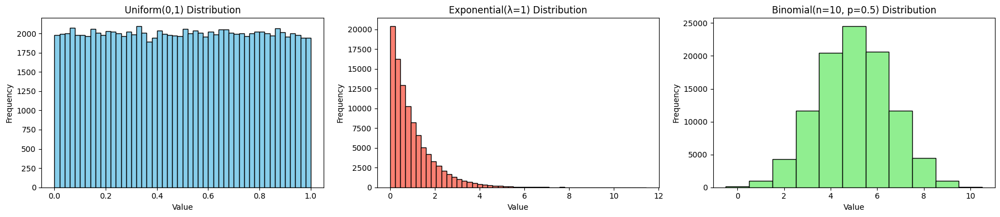
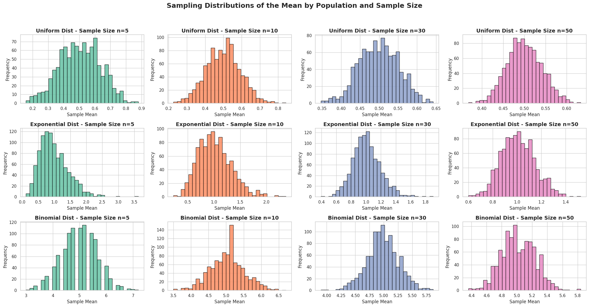

# Problem 1

# 📊 Simulating Sampling Distributions


### 🎯 Objective
To demonstrate the Central Limit Theorem (CLT), we begin by generating large populations from various distributions:

- Uniform Distribution
- Exponential Distribution
- Binomial Distribution

Each dataset will represent a "population", from which we will later draw repeated random samples to study the behavior of their means.

---

## 🔢 Step 1: Generate Populations

Let:
- $N = 100000$ be the size of each simulated population.

We will define each population as follows:

- **Uniform Distribution**:  

$$X \sim \text{Uniform}(a=0, b=1)$$

- **Exponential Distribution**:  

$$X \sim \text{Exponential}(\lambda=1)$$

- **Binomial Distribution**:  

$$X \sim \text{Binomial}(n=10, p=0.5)$$

---

### 🧪 Python Code/ Visual



---

```python
import numpy as np
import matplotlib.pyplot as plt

# Set seed for reproducibility
np.random.seed(42)

# Population size
N = 100_000

# --- Generate Populations ---
# 1. Uniform Distribution: U(0, 1)
population_uniform = np.random.uniform(low=0, high=1, size=N)

# 2. Exponential Distribution: Exp(λ=1)
population_exponential = np.random.exponential(scale=1.0, size=N)

# 3. Binomial Distribution: Binomial(n=10, p=0.5)
population_binomial = np.random.binomial(n=10, p=0.5, size=N)

# --- Plot Histograms ---
fig, axs = plt.subplots(1, 3, figsize=(18, 4))

# Uniform
axs[0].hist(population_uniform, bins=50, color='skyblue', edgecolor='black')
axs[0].set_title("Uniform(0,1) Distribution")
axs[0].set_xlabel("Value")
axs[0].set_ylabel("Frequency")

# Exponential
axs[1].hist(population_exponential, bins=50, color='salmon', edgecolor='black')
axs[1].set_title("Exponential(λ=1) Distribution")
axs[1].set_xlabel("Value")
axs[1].set_ylabel("Frequency")

# Binomial
axs[2].hist(population_binomial, bins=range(0,12), color='lightgreen', edgecolor='black', align='left')
axs[2].set_title("Binomial(n=10, p=0.5) Distribution")
axs[2].set_xlabel("Value")
axs[2].set_ylabel("Frequency")

plt.tight_layout()
plt.show()
```

---

### 🧠 Observations

- The **Uniform distribution** is symmetric and flat.

- The **Exponential distribution** is positively skewed, with a long tail.

- The **Binomial distribution** appears discrete and approximately symmetric for $p=0.5$, $n=10$.

These variations in shape are crucial because, according to the **Central Limit Theorem**, the **sampling distribution of the sample mean** should approach a **normal distribution**, even if the underlying population is not normal.

---

# 📈 Sampling and Visualization


### 🎯 Objective
Now that we've simulated our population distributions, we move to the core demonstration of the **Central Limit Theorem (CLT)** by:

- Drawing repeated random samples of various sizes.
- Calculating sample means.
- Building and visualizing sampling distributions.
- Observing how they approach normality.

---

## 🔁 Step-by-Step Procedure

### 1. Select Sample Sizes

We will use the following sample sizes:

- $n = 5$

- $n = 10$

- $n = 30$

- $n = 50$

### 2. Sampling Process

Let:
- $R = 1000$ be the number of repetitions (samples drawn per sample size).

- For each sample size $n$, and each population:

- Draw $R$ samples of size $n$.

- Compute the sample mean $\bar{X}$ for each.

- Store these means to analyze their distribution.

---

## 🧪 Python Code


```python
import numpy as np
import matplotlib.pyplot as plt

# Parameters
sample_sizes = [5, 10, 30, 50]
repeats = 1000

# Store results
sampling_results = {
    "uniform": {},
    "exponential": {},
    "binomial": {}
}

# Sampling function
def simulate_sampling_distribution(population, name):
    for n in sample_sizes:
        means = []
        for _ in range(repeats):
            sample = np.random.choice(population, size=n, replace=False)
            sample_mean = np.mean(sample)
            means.append(sample_mean)
        sampling_results[name][n] = means

# Run simulations
simulate_sampling_distribution(population_uniform, "uniform")
simulate_sampling_distribution(population_exponential, "exponential")
simulate_sampling_distribution(population_binomial, "binomial")
```

---

## 📊 Visualization

We will now plot the **sampling distribution of the mean** for each combination of:

- Distribution: Uniform, Exponential, Binomial

- Sample Size: $n = 5, 10, 30, 50$

---



---


```python
import matplotlib.pyplot as plt
import seaborn as sns

# Seaborn style for aesthetics
sns.set(style="whitegrid")

# Plot sampling distributions
fig, axs = plt.subplots(3, 4, figsize=(22, 12))
distributions = ["uniform", "exponential", "binomial"]
titles = ["Uniform", "Exponential", "Binomial"]
colors = sns.color_palette("Set2", 4)

for i, dist in enumerate(distributions):
    for j, n in enumerate(sample_sizes):
        axs[i][j].hist(
            sampling_results[dist][n],
            bins=30,
            color=colors[j],
            edgecolor='black',
            alpha=0.85
        )
        axs[i][j].set_title(f"{titles[i]} Dist - Sample Size n={n}", fontsize=14, fontweight='bold')
        axs[i][j].set_xlabel("Sample Mean", fontsize=12)
        axs[i][j].set_ylabel("Frequency", fontsize=12)

# Add an overall title
fig.suptitle("Sampling Distributions of the Mean by Population and Sample Size", fontsize=18, fontweight='bold')
plt.tight_layout(rect=[0, 0.03, 1, 0.95])
plt.show()
```

---

## 📚 Theoretical Background

According to the **Central Limit Theorem**, for a sufficiently large sample size $n$:

> The distribution of the sample mean $\bar{X}$ tends toward a normal distribution, regardless of the shape of the population distribution, provided the variance $\sigma^2$ is finite.

Mathematically:

- If $X_1, X_2, \dots, X_n$ are i.i.d. with mean $\mu$ and variance $\sigma^2$, then:

$$
\bar{X} = \frac{1}{n} \sum_{i=1}^n X_i \quad \text{converges in distribution to} \quad \mathcal{N}(\mu, \frac{\sigma^2}{n})
$$

---

## 🧠 Observations

- As $n$ increases:
  - The histograms of sample means become more **bell-shaped**.
  - This occurs **even when the original distribution is skewed**, e.g., Exponential.
- The **spread** of the sampling distribution decreases with larger $n$, consistent with:

$$
\text{Standard Error} = \frac{\sigma}{\sqrt{n}}
$$

---

# 🧪 Parameter Exploration


In this section, we explore **how different parameters influence the behavior of sampling distributions** under the Central Limit Theorem (CLT).

---

## 🔍 1. Effect of the Original Distribution Shape

- **Key Insight**: The **more skewed or non-normal** the original population is, the **slower** the convergence to a normal distribution.
- **Visual Observation**:
  - Sampling distributions from the **Exponential distribution** (heavily skewed) take longer to appear normal.
  - Sampling distributions from **Uniform or Binomial (p ≈ 0.5)** appear bell-shaped even at moderate sample sizes.
- **CLT Implication**:
  - For highly non-normal populations, a **larger $n$ is needed** for the sampling distribution of the mean to approximate normality.

---

## 📈 2. Influence of Sample Size on Normality

Let:

- $X_1, X_2, \dots, X_n$ be i.i.d. random variables with mean $\mu$ and variance $\sigma^2$

- $\bar{X} = \frac{1}{n} \sum_{i=1}^n X_i$

Then, by the **Central Limit Theorem**:

$$
\bar{X} \xrightarrow{d} \mathcal{N}(\mu, \frac{\sigma^2}{n}) \quad \text{as} \quad n \to \infty
$$

- **Observation**:
  - As $n$ increases, the **shape** of the sampling distribution becomes more symmetric and bell-shaped.
  - The convergence is **faster** when the population is closer to normal.

---

## 📊 3. Role of Population Variance in Spread

- **Standard Error (SE)** of the sample mean is:

$$
\text{SE}_{\bar{X}} = \frac{\sigma}{\sqrt{n}}
$$

- **Implications**:
  - Populations with **larger variance $\sigma^2$** yield **wider sampling distributions**.
  - As sample size $n$ increases, SE decreases, causing the sampling distribution to **narrow**.

### 📝 Summary Table

| Factor                          | Effect on Sampling Distribution                             |
|-------------------------------|-------------------------------------------------------------|
| Shape of Original Distribution | Skewed → slower normal convergence                         |
| Sample Size ($n$)              | Larger $n$ → faster convergence, tighter distribution       |
| Population Variance ($\sigma^2$) | Higher variance → wider spread in sample means             |

---

## 📚 Interpretation

These effects are critical when:
- **Designing experiments**: Choose a sufficiently large $n$ based on the distribution shape.
- **Estimating parameters**: Know that estimates are more precise when variance is low or $n$ is high.
- **Communicating uncertainty**: Larger spreads in sampling distributions indicate higher estimation uncertainty.

---

# 🌍 Practical Applications of the Central Limit Theorem


The **Central Limit Theorem (CLT)** plays a foundational role across many fields by enabling the use of **normal approximation** when analyzing sample means — even when the original data is not normally distributed.

---

## 📐 1. Estimating Population Parameters

- When taking a sample of size $n$ from a population with:

- Mean $\mu$

- Standard deviation $\sigma$

- The sample mean $\bar{X}$ is used to **estimate** the population mean:

$$
\mathbb{E}[\bar{X}] = \mu
$$

- Due to CLT:

$$
\bar{X} \sim \mathcal{N}\left(\mu, \frac{\sigma^2}{n}\right)
$$

- This allows us to:

  - Construct **confidence intervals**

$$
\bar{X} \pm z_{\alpha/2} \cdot \frac{\sigma}{\sqrt{n}}
$$

- Perform **hypothesis testing** using $z$-scores.

✅ **Use Case**: Estimating the average height, income, or lifespan from survey data.

---

## 🏭 2. Quality Control in Manufacturing

- Suppose a factory produces parts with a target dimension (e.g., length = 5cm).
- Random samples of $n$ units are taken periodically.
- If the **sample mean** deviates significantly from the target, corrective action is taken.

- Using CLT, the distribution of the sample mean allows creation of **control charts**:
  - Define control limits at:

$$
\mu \pm 3 \cdot \frac{\sigma}{\sqrt{n}}
$$

- This detects issues like:
  - Machine misalignment
  - Material flaws
  - Process drift

✅ **Use Case**: Monitoring packaging weight, fluid volumes, or part dimensions.

---

## 💹 3. Financial Outcome Predictions

- Financial metrics (e.g., returns, costs, profits) often come from **aggregates** of many random variables.
- Thanks to CLT:
  - The **total return** or **average risk** from a portfolio of assets approximates normality.
  - Enables use of tools like:
    - **Value-at-Risk (VaR)**
    - **Monte Carlo simulations**

- Example:

$$
\text{Portfolio Return} = \frac{1}{n} \sum_{i=1}^n R_i \approx \mathcal{N}\left(\mu, \frac{\sigma^2}{n}\right)
$$

✅ **Use Case**: Estimating probable gains/losses for investments over time.

---

## 🧠 Conclusion

The **Central Limit Theorem** enables:
- Reliable estimation even from **non-normal populations**
- **Inferential power** in small to medium sample sizes
- Foundation for **statistical decision-making** in science, industry, and finance

📌 It's one of the most **powerful bridges** between **theory and practice** in statistics.

---


