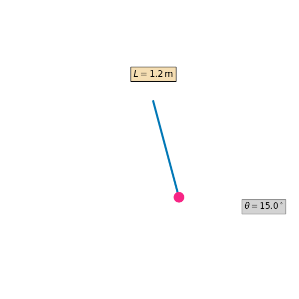

# Problem 1

# 📏 Measuring Earth's Gravitational Acceleration with a Pendulum



---

## 🧪 Materials & Setup

### ✅ Materials Needed

- A **string** (~1 or 1.5 meters long)  
- A **small weight** (e.g., bag of coins, sugar, or a keychain)  
- A **stopwatch** or **smartphone timer**  
- A **ruler** or **measuring tape**  

---

### 🔧 Experimental Setup

1. **Construct the Pendulum**  
   Attach the weight to one end of the string and secure the other end to a sturdy support, allowing it to swing freely.

2. **Measure Pendulum Length**  
   - Measure the length $L$ from the **suspension point** to the **center of mass** of the weight.  
   - Record this value carefully using a ruler or tape measure.

3. **Note Instrument Resolution**  
   - Record the **resolution** of the measuring instrument (typically in centimeters or millimeters).

4. **Calculate Uncertainty in Length Measurement**  
   Use the formula:

$$\Delta L=\frac{\text{Resolution of Ruler}}{2}$$

- This represents the **uncertainty** due to the finite precision of your measuring tool.  
- For example, if the smallest division is 1 mm, then:  
$$\Delta L=\frac{1\,\text{mm}}{2}=0.5\,\text{mm}=0.0005\,\text{m}$$

---

### 📌 Summary of Setup Values (Example Format)

| Quantity            | Symbol        | Value   | Units | Notes                               |
|---------------------|---------------|---------|-------|-------------------------------------|
| Pendulum Length     | $L$           | 1.200   | m     | Measured from pivot to mass center |
| Ruler Resolution    | –             | 1       | mm    | Smallest readable unit              |
| Uncertainty in $L$  | $\Delta L$    | 0.0005  | m     | $\Delta L=\frac{1}{2}\,\text{mm}$   |

---

## ⏱️ Data Collection


### 🌀 Procedure

- **Displace** the pendulum to an angle less than $15^\circ$ and release it gently.  
- **Measure the time** it takes for **10 full oscillations**. Denote this time as $T_{10}$.
- **Repeat the measurement** a total of **10 times** to collect a reliable data set.

---

### 🧾 Record Measurements

- Collect and tabulate all **10 values of** $T_{10}$.
- Use a table like the following:

| Trial | $T_{10}$ (s) |
|-------|--------------|
| 1     |              |
| 2     |              |
| ...   |              |
| 10    |              |

---

### 📊 Statistical Analysis


---

1. **Calculate the mean time for 10 oscillations:**

$$
\overline{T}_{10} = \frac{1}{n} \sum_{i=1}^{n} T_{10}^{(i)}
$$

where $n = 10$ and $T_{10}^{(i)}$ is the time from the $i^{\text{th}}$ trial.

2. **Compute the standard deviation** of the $T_{10}$ values:

$$
\sigma_T = \sqrt{\frac{1}{n-1} \sum_{i=1}^{n} \left(T_{10}^{(i)} - \overline{T}_{10}\right)^2}
$$

3. **Determine the uncertainty in the mean time:**

$$
\Delta T_{10} = \frac{\sigma_T}{\sqrt{n}}
$$

This represents the **standard error of the mean**, which quantifies the precision of your mean timing result.

---

### 🧮 Example Output Table

| Quantity             | Symbol            | Formula                                      | Units |
|----------------------|-------------------|----------------------------------------------|--------|
| Mean of 10 times     | $\overline{T}_{10}$ | $\frac{1}{n} \sum T_{10}^{(i)}$               | s      |
| Standard deviation   | $\sigma_T$        | $\sqrt{\frac{1}{n-1} \sum (T_{10}-\overline{T}_{10})^2}$ | s      |
| Uncertainty in mean  | $\Delta T_{10}$   | $\frac{\sigma_T}{\sqrt{n}}$                  | s      |

---


## 📚 Analysis

---

### ✅ Comparison with Standard Value

- The experimentally determined value of gravitational acceleration is:

$$
g_{\text{measured}} = \frac{4\pi^2 L}{T^2}
$$

- The **standard accepted value** is:

$$
g_{\text{standard}} = 9.81\, \text{m/s}^2
$$

- Compare the measured value of $g$ with $9.81\, \text{m/s}^2$.
  - If the two values agree **within the uncertainty** $\Delta g$, the experiment can be considered successful.
  - Consider the relative error:

$$
\text{Relative Error} = \frac{|g_{\text{measured}} - g_{\text{standard}}|}{g_{\text{standard}}} \times 100\%
$$

---

### 🧾 Uncertainty Discussion

#### 🔬 Effect of Measurement Resolution on $\Delta L$

- The uncertainty in length, $\Delta L$, is directly related to the **resolution of the measuring instrument**:

$$
\Delta L = \frac{\text{Resolution}}{2}
$$

- If the ruler has a coarse resolution (e.g., 1 cm), this increases $\Delta L$, and in turn, increases the total uncertainty $\Delta g$ via:

$$
\Delta g \propto \frac{\Delta L}{L}
$$

- **Better measuring tools** (e.g., a caliper or laser ruler) would reduce $\Delta L$ and improve the accuracy of $g$.

---

#### ⏱️ Impact of Timing Variability on $\Delta T$

- The time measurements are **subjective** if done manually, leading to random errors.
- Timing variability is quantified by the **standard deviation** $\sigma_T$ and the uncertainty in the mean:

$$
\Delta T = \frac{\sigma_T}{\sqrt{n} \cdot 10}
$$

- This impacts the uncertainty in $g$ quadratically:

$$
\Delta g \propto 2 \cdot \frac{\Delta T}{T}
$$

- **Using photogates or electronic timers** would minimize this variability significantly.

---

### ⚠️ Assumptions and Limitations

- The angle of release is **assumed to be small** ($< 15^\circ$) so that the pendulum follows **simple harmonic motion**.
- Air resistance and friction at the pivot are **neglected**.
- The string is assumed to be **massless and inextensible**.
- The center of mass of the bob is assumed to be **clearly defined and accurately measurable**.
- Human reaction time introduces **systematic uncertainty** in timing.

---

### 📌 Conclusion


---

- Ensure that the final reported value of $g$ is written with its **uncertainty**:

$$
g = g_{\text{measured}} \pm \Delta g \quad \text{(in m/s}^2\text{)}
$$

- Evaluate whether this range includes the accepted value $9.81\, \text{m/s}^2$.

---


## Python Codes


```python
# ▶️ Install required library (only needed once in Colab)
!pip install -q pillow

import numpy as np
import matplotlib.pyplot as plt
from matplotlib.animation import FuncAnimation, PillowWriter

# === Physics Constants ===
L = 1.2  # Pendulum length in meters
theta_max = np.radians(15)  # Max angular displacement
g = 9.81  # Gravitational acceleration
omega = np.sqrt(g / L)
period = 2 * np.pi * np.sqrt(L / g)
t_vals = np.linspace(0, 2 * period, 100)

# === Set up figure and axis ===
fig, ax = plt.subplots(figsize=(6, 6))
ax.set_xlim(-1.4, 1.4)
ax.set_ylim(-1.6, 0.4)
ax.set_aspect('equal')
ax.axis('off')  # Hide axes

# === Pendulum Graphics ===
line, = ax.plot([], [], lw=3, color='#0077b6')
bob = plt.Circle((0, -L), 0.06, color='#f72585', zorder=5)
ax.add_patch(bob)

# === Static Text Annotations (positioned safely outside swing) ===
length_label = ax.text(0, 0.3, "$L = 1.2\\,\\mathrm{m}$", fontsize=13,
                       ha='center', bbox=dict(facecolor='wheat', edgecolor='black'))

angle_label = ax.text(1.1, -1.3, "", fontsize=12, color='black',
                      bbox=dict(facecolor='lightgray', edgecolor='gray'))

# === Animation Function ===
def animate(i):
    t = t_vals[i]
    theta = theta_max * np.cos(omega * t)
    
    x = L * np.sin(theta)
    y = -L * np.cos(theta)

    # Update pendulum position
    line.set_data([0, x], [0, y])
    bob.center = (x, y)
    
    # Update angle text
    angle_deg = np.degrees(theta)
    angle_label.set_text(f"$\\theta = {angle_deg:.1f}^\\circ$")
    
    return line, bob, angle_label

# === Create Animation ===
ani = FuncAnimation(fig, animate, frames=len(t_vals), interval=50, blit=True)

# Save as GIF
gif_path = "/content/pendulum_setup_clean.gif"
ani.save(gif_path, writer=PillowWriter(fps=20))
plt.close()

# Display GIF
from IPython.display import Image
Image(filename=gif_path)
```

---


```python
import matplotlib.pyplot as plt
import numpy as np

# === 🔢 Input Your Experimental Results ===
g_measured = 9.77        # replace with your measured g
delta_g = 0.10           # replace with your uncertainty in g
g_standard = 9.81        # standard gravity

# === ⚙️ Data Setup ===
positions = [0, 1]
labels = ['Measured $g$', 'Standard $g$']
values = [g_measured, g_standard]
errors = [delta_g, 0]  # Only measured g has uncertainty

colors = ['#00b4d8', '#90be6d']  # measured and standard

# === 📊 Create Plot ===
fig, ax = plt.subplots(figsize=(10, 6))

bars = ax.bar(
    positions,
    values,
    yerr=errors,
    capsize=10,
    color=colors,
    edgecolor='black',
    alpha=0.9
)

# === 📍 Annotate Bars ===
ax.text(
    positions[0], g_measured + delta_g + 0.1,
    f"$g_{{measured}} = {g_measured:.2f} \pm {delta_g:.2f}$ m/s²",
    ha='center',
    fontsize=12,
    bbox=dict(boxstyle="round,pad=0.4", fc="#ffd6a5", ec="black", alpha=0.85)
)

ax.text(
    positions[1], g_standard + 0.1,
    f"$g_{{standard}} = {g_standard:.2f}$ m/s²",
    ha='center',
    fontsize=12,
    bbox=dict(boxstyle="round,pad=0.4", fc="#d0f4de", ec="black", alpha=0.85)
)

# === 📘 Additional Explanation ===
ax.annotate(
    "Uncertainty range\n(± Δg)",
    xy=(0, g_measured + delta_g),
    xytext=(0.1, g_measured + delta_g + 0.6),
    arrowprops=dict(arrowstyle="->", color='black'),
    fontsize=11,
    bbox=dict(boxstyle="round", fc="#fefae0", ec="gray", alpha=0.9)
)

# === 🎨 Styling ===
ax.set_title("🌍 Comparison of Measured vs Standard Gravitational Acceleration", fontsize=16, weight='bold')
ax.set_ylabel("Gravitational Acceleration (m/s²)", fontsize=13)
ax.set_xticks(positions)
ax.set_xticklabels(labels, fontsize=12)
ax.set_ylim(0, max(g_measured + delta_g, g_standard) + 1)

# Add horizontal reference line
ax.axhline(g_standard, color='#6a994e', linestyle='--', linewidth=1.5, alpha=0.7)

# Grid
ax.yaxis.grid(True, linestyle='--', alpha=0.5)

# Final layout
plt.tight_layout()
plt.show()
```

---


```python
# ✅ Pendulum Gravity Measurement Tool with Beautiful Plot

import numpy as np
import matplotlib.pyplot as plt

# 📥 Your 10 measurements of T_10 (in seconds)
T_10_measurements = np.array([21.40, 21.52, 21.47, 21.35, 21.60, 21.43, 21.50, 21.44, 21.38, 21.46])

# ⚙️ Constants
n = len(T_10_measurements)
ruler_resolution_mm = 1.0           # mm
L = 1.200                           # pendulum length in meters
delta_L = (ruler_resolution_mm / 1000) / 2  # Convert mm to m, divide by 2

# 📊 Stats calculations
T10_mean = np.mean(T_10_measurements)
sigma_T = np.std(T_10_measurements, ddof=1)
delta_T10 = sigma_T / np.sqrt(n)

T = T10_mean / 10
delta_T = delta_T10 / 10

g = (4 * np.pi**2 * L) / (T**2)
delta_g = g * np.sqrt((delta_L / L)**2 + (2 * delta_T / T)**2)

# 🖨️ Results
print("=== Results ===")
print(f"Mean T_10 = {T10_mean:.4f} s")
print(f"Standard deviation σ_T = {sigma_T:.4f} s")
print(f"Uncertainty in mean ΔT_10 = {delta_T10:.4f} s")
print(f"Single period T = {T:.4f} ± {delta_T:.4f} s")
print(f"g = {g:.4f} ± {delta_g:.4f} m/s²")

# 🎨 Plot
fig, ax = plt.subplots(figsize=(10, 6))
x = np.arange(1, n + 1)

# Error bars and points
ax.errorbar(x, T_10_measurements, yerr=delta_T10, fmt='o', color='teal',
            ecolor='salmon', elinewidth=2, capsize=5, label='T₁₀ Measurements')

# Mean line
ax.axhline(T10_mean, color='orange', linestyle='--', linewidth=2, label=f'Mean = {T10_mean:.2f} s')

# Labels and Title
ax.set_title("Pendulum Timing Measurements ($T_{10}$)", fontsize=16, weight='bold')
ax.set_xlabel("Trial Number", fontsize=13)
ax.set_ylabel("Time for 10 Oscillations (s)", fontsize=13)
ax.grid(True, linestyle='--', alpha=0.5)
ax.legend(fontsize=12)

# Annotation box
textstr = '\n'.join((
    f'$\overline{{T_{{10}}}}$ = {T10_mean:.2f} s',
    f'$\sigma_T$ = {sigma_T:.3f} s',
    f'$\\Delta T_{{10}}$ = {delta_T10:.3f} s',
    f'$T$ = {T:.3f} s ± {delta_T:.3f} s',
    f'$g$ = {g:.3f} ± {delta_g:.3f} m/s²'
))
props = dict(boxstyle='round', facecolor='wheat', alpha=0.8)
ax.text(0.05, 0.95, textstr, transform=ax.transAxes, fontsize=12,
        verticalalignment='top', bbox=props)

plt.tight_layout()
plt.show()
```